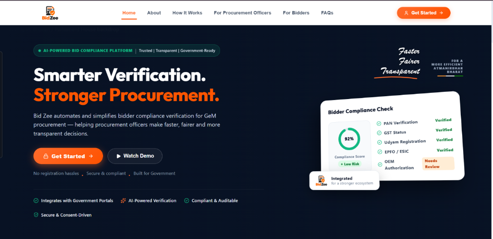
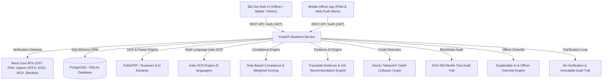

# Bid Zee — AI-Powered Integrated Bid Compliance Verification Platform for GeM Procurement

[](https://www.python.org/)
[](https://fastapi.tiangolo.com/)
[](https://reactjs.org/)
[](https://vitejs.dev/)
[](LICENSE)

**Problem Statement ID**: SIH26100  
**Project Name**: Bid Zee / GeM Integrated Bid Compliance Verification Platform  
**Target Platform**: Government e-Marketplace (GeM) Procurement Portal  
**Live Website**: https://ai-powered-integrated-bid-complianc-kappa.vercel.app/  
**Full Platform / Judges Demo**: https://youtu.be/8_x7qEE0GNA  
**Bidder Portal Walkthrough**: https://youtu.be/-qEZH7ONSDo  

> [!IMPORTANT]
> **Core Product Principle**: Bid Zee is an **AI-assisted decision-support & verification platform**. The AI NEVER independently qualifies or disqualifies a bidder. All final qualification and disqualification decisions remain exclusively with the Procurement Officer.



[▶ Watch Full Platform Video Demo](https://youtu.be/8_x7qEE0GNA) | [🌐 Visit Live Website](https://ai-powered-integrated-bid-complianc-kappa.vercel.app/) | [▶ Watch Bidder Walkthrough](https://youtu.be/-qEZH7ONSDo)

---

## 🚀 Key Platform Features

### 1. 6-Step Guided Tender Creation Wizard
- **Step 1 — Basic Information**: Tender ID, Reference Number, Title, Department, Category, Description, Estimated Value, Publication & Submission Deadlines.
- **Step 2 — Statutory Eligibility Requirements**: Configure GST, PAN, Udyam, Income Tax, EPFO, ESIC, Make in India, OEM Authorization, Blacklisting requirements.
- **Step 3 — Required Documents**: Configure allowed file formats (`.pdf`, `.png`, `.jpg`), max file sizes, and expiry validation toggles.
- **Step 4 — Verification Rules**: Toggle Government API portal lookup, OCR extraction, AI field parsing, cross-doc matching, fuzzy name matching, registration number validation, and blacklist registry checks.
- **Step 5 — Configurable Scoring Weights & Risk Thresholds**: Scoring weights summing to 100 points, configurable risk level score bands (`LOW`: 90–100, `MEDIUM`: 75–89, `HIGH`: 50–74, `CRITICAL`: 0–49).
- **Step 6 — Review & Publish**: Summary card before publishing.

---

### 2. AI Tender Requirement Analyzer Service
- Analyzes tender description, title, category, estimated value, and additional conditions.
- Intelligently suggests required documents, compliance checks, and scoring weights (summing to 100).
- Categorizes requirements into `MANDATORY` (for explicit rules), `OPTIONAL`, and `REVIEW_REQUIRED` (for inferred requirements).
- Provides tender-specific explanations for every recommendation.

---

### 3. Verification Gateway (Mock Government APIs)
Provides modular verification endpoints simulating live government portals:
- `GET /api/verify/gst/{gstin}` — GSTN Portal active status & return filings
- `GET /api/verify/pan/{pan}` — Income Tax PAN registry & legal name
- `GET /api/verify/udyam/{udyam_id}` — Udyam MSME category & status
- `GET /api/verify/mca/{cin}` — MCA21 corporate incorporation status
- `GET /api/verify/epfo/{epfo_id}` — EPFO employer compliance & remittance status
- `GET /api/verify/esic/{esic_id}` — ESIC employer status
- `GET /api/verify/startup/{dippt_id}` — Startup India recognition status
- `GET /api/verify/nsic/{nsic_id}` — NSIC registration status
- `GET /api/verify/blacklist/{identifier}` — Central Debarment Database lookup
- `GET /api/verify/digilocker/{doc_id}` — DigiLocker official document verification

### Verification Gateway — Hybrid Live & Simulated Adapters

The platform uses a pluggable **adapter pattern** for verification services:

> **Verification Gateway**: MCA21 registry is queried live via the Government of India Open Data platform (`data.gov.in`, GODL-licensed). Other registries (GSTN, PAN, EPFO, ESIC, DigiLocker) use simulated adapters in demo mode; a production adapter layer is ready for Sandbox.co.in / Setu integration.

| System | Gateway Adapter | Gateway Mode | Data Source & License |
|---|---|---|---|
| **MCA21** | `DataGovMCAAdapter` | **Live (`data.gov.in`)** | Government of India Open Data Platform (~3.67M MCA Records, GODL License) |
| **GSTN** | `GSTAdapter` | Simulated Demo Mode | Prepared for GSTN Sandbox v2.0 / Sandbox.co.in |
| **PAN** | `PANAdapter` | Simulated Demo Mode | Prepared for NSDL / ITD verification API |
| **Udyam** | `UdyamAdapter` | Simulated Demo Mode | Prepared for Udyam MSME verification API |
| **DigiLocker** | `DigiLockerAdapter` | Simulated Demo Mode | Prepared for DigiLocker OAuth2 consent flow |
| **EPFO / ESIC** | `EPFOAdapter` / `ESICAdapter` | Simulated Demo Mode | Prepared for Employer verification gateways |
| **Blacklist** | `DebarmentAdapter` | Simulated Demo Mode | Central Debarment Database |

#### 🌐 Open Government Data Platform (`data.gov.in`) Live API Specs

Bid Zee integrates live with the **Government of India Open Data Platform (`data.gov.in`)** for instant verification of corporate entities under the **Government Open Data License – India (GODL)**:

- **API Endpoint**: `https://api.data.gov.in/resource/41233261-26c9-4f24-9b1a-ae970c675f92`
- **Resource ID**: `41233261-26c9-4f24-9b1a-ae970c675f92` (Ministry of Corporate Affairs - Master Data)
- **Coverage**: ~3.67 Million active & registered Indian companies
- **License**: Government Open Data License – India (GODL)
- **Live Extracted Attributes**:
  - `corporate_identification_number` (CIN)
  - `company_name` & `company_status` (Active / Active in Progress / Struck Off)
  - `roc_code` (Registrar of Companies regional authority)
  - `authorized_capital` & `paid_up_capital`
  - `date_of_registration` & `registered_office_address`

##### Configuration (`backend/.env`)
```ini
MCA_GATEWAY_MODE=live
DATA_GOV_IN_API_KEY=<your-data.gov.in-api-key>   # request at https://api.data.gov.in (do not commit real keys)
DATA_GOV_IN_MCA_RESOURCE_ID=41233261-26c9-4f24-9b1a-ae970c675f92
```

> **Automatic Graceful Fallback**: If the external `data.gov.in` API endpoint is unreachable or encounters network latency, `DataGovMCAAdapter` automatically falls back to internal database verification to guarantee uninterrupted platform availability.

---


### 4. Evidence-First AI & Bidder Verification View
- Displays overall compliance score dial (`86 / 100`), risk classification (`MEDIUM`), and status (`UNDER REVIEW`).
- Interactive requirement checklist showing `✓ VERIFIED`, `⚠ NEEDS REVIEW`, and `❌ MISSING / FAILED`.
- Clickable Evidence Modal displaying: *WHAT was checked*, *WHERE checked*, *Extracted vs Registry Data*, *RESULT*, *WHEN verified*, and *WHAT officer should do next*.
- AI recommendation outputs `"Procurement Officer Review Required"`.

---

### 5. Clarification & Re-Verification Loop
1. Procurement Officer flags a requirement (e.g. OEM Authorization) and sends clarification instructions.
2. Bidder receives in-app notification & uploads replacement document.
3. System automatically re-runs OCR -> Extraction -> Mock Gateway Lookup -> Cross-matching -> Scoring.
4. Score updates (e.g. 78/100 -> 94/100), risk changes (MEDIUM -> LOW), officer is notified, and complete versioned audit log is preserved.

---

### 6. Role-Based Workflows & User Management
- **Procurement Officer**: Create/configure tenders, view submitted bidders, run/re-run verification, review AI findings & evidence, request clarification, approve/reject requirements, make final qualification decision, view audit trail.
- **Bidder**: Explore active tenders, apply to tender, drag-and-drop document uploader with real-time status & replacement controls, view compliance status, respond to clarification requests.
- **Admin Console & Security**: Full user profile management (`PUT /api/admin/users/{id}`), role assignment (`Super Admin`, `Procurement Officer`, `Verification Officer`, `Auditor`, `Bidder`), department configuration, **[ Grant Access ]** account approvals for pending officers, password resets, account suspension/reactivation, system-wide audit logs, strict **user data isolation**, and **IDOR protection** on documents and bid records.

---

### 7. Advanced Integrity, Intelligence & Real-Time Monitoring Features

- **Cartel Collusion Graph** — Neo4j/NetworkX-based detection of bid-rigging patterns using shared DINs, addresses, bank accounts, and IP patterns.
- **Merkle Tree Blockchain Audit** — SHA-256 hash-chained, tamper-evident audit trail with Merkle proof verification for every bid decision.
- **Explainable AI (XAI) & Officer Override** — Every AI recommendation shows document title, page number, quote snippet, confidence score, and an officer override path with mandatory justification.
- **Multi-Language Indic OCR** — Supports English, Hindi, Gujarati, Marathi, Tamil, Bengali, Telugu, and other Indic languages for inclusive bid participation.
- **WebSocket Live Bid Stream & Real-Time Monitoring** — Real-time bid submission feed, status updates, and live monitoring via WebSocket endpoint (`/api/monitoring/ws`).
- **System Performance & Latency Benchmark Dashboard** — Built-in benchmarking dashboard measuring verification latency, throughput, OCR processing time, and indexed query performance.
- **Mobile Officer App (PWA & Web Push)** — Mobile-optimized officer interface with web push notifications for critical bid compliance events.

---

### 8. Synthetic Datasets & Mock Verification Importer

The platform includes a complete test dataset importer and document generator for rapid offline demonstration and evaluation:

- **Script**: `scripts/import_mock_dataset.py`
- **Data Location**: `mock-data/dataset/`
- **Features**: Generates sample PNG/PDF statutory certificates (GST, PAN, Udyam) and imports structured test bidder profiles directly into the platform database.
- **Usage**:
  ```bash
  python scripts/import_mock_dataset.py
  ```

---

## MyGeM AI Assistant

**MyGeM** is Bid Zee's built-in conversational assistant for bidders, procurement officers, and administrators. Available after login, it helps users understand portal workflows, bid documents, and compliance requirements.

### Features

- **Bid compliance guidance**: Answers questions about document requirements and statutory identifiers such as GSTIN, PAN, and Udyam.
- **AI answers and live web search**: Uses Groq for conversational responses and, when configured and enabled, web search for current questions. A local knowledge base provides fallback guidance when the AI service is unavailable.
- **Multilingual conversations**: Offers automatic language detection and a language selector, including regional Indian languages.
- **Readable responses and calculations**: Supports bold formatting and instructions for clear, plain-text calculation answers.
- **Application tracking and support**: Provides dedicated menus for application tracking, support tickets, and live support, with a support inbox for administrators.
- **Chat controls**: Lets users start a new conversation and adjust the chat window.

> [!NOTE]
> MyGeM provides guidance; final bidder qualification and disqualification decisions remain with the Procurement Officer.

---

## 🎯 Key Assets & Documentation Quick Links

### Platform Guides & Media
- 🌐 **Live Website**: [ai-powered-integrated-bid-complianc-kappa.vercel.app](https://ai-powered-integrated-bid-complianc-kappa.vercel.app/)
- 🏆 **Full Platform / Judges Video Demo**: [▶ Watch Full Demo (YouTube)](https://youtu.be/8_x7qEE0GNA)
- 🎥 **Bidder Portal Walkthrough**: [▶ Watch User Walkthrough (YouTube)](https://youtu.be/-qEZH7ONSDo)
- 📄 **Implementation Plan**: [`implementation_plan.md`](implementation_plan.md)
- 🎬 **Walkthrough & Evaluation Guide**: [`walkthrough.md`](walkthrough.md) | [`docs/DEMO_GUIDE.md`](docs/DEMO_GUIDE.md)
- ⚡ **Platform Launcher Scripts**: [`run_platform.ps1`](run_platform.ps1) & [`run_platform.bat`](run_platform.bat)

### Technical Verification & Performance Reports
- 📊 **User Auth & Stability Report**: [`USER_AUTH_STABILITY_REPORT.md`](USER_AUTH_STABILITY_REPORT.md)
- ⚡ **Database Performance Report**: [`DATABASE_PERFORMANCE_REPORT.md`](DATABASE_PERFORMANCE_REPORT.md)
- 🛡️ **Production Readiness Report**: [`PRODUCTION_READINESS_REPORT.md`](PRODUCTION_READINESS_REPORT.md)
- 🚀 **Pre-Launch Infrastructure Audit**: [`PRE_LAUNCH_REPORT.md`](PRE_LAUNCH_REPORT.md)
- 🔧 **API Production Fix Log**: [`API_PRODUCTION_FIX.md`](API_PRODUCTION_FIX.md)

---

## 🏗️ System Architecture



---

## 🚀 Running the Platform Locally

### Windows Quick Launcher
Double-click `run_platform.bat` or execute in PowerShell:
```powershell
.\run_platform.ps1
```

### Manual Execution

#### 1. Backend Service
```bash
cd backend
python -m venv venv
# Windows
venv\Scripts\activate

# macOS / Linux
source venv/bin/activate
pip install -r requirements.txt
python -m uvicorn app.main:app --reload --port 8000
```

#### 2. Frontend Application
```bash
cd frontend
npm install
npm run dev
```

Open your browser at `http://localhost:5173`.

---

## 🧪 Running Tests

### Backend Test Suite
```bash
cd backend
# Windows
venv\Scripts\activate

# macOS / Linux
source venv/bin/activate
pytest
```

### Frontend Build Check
```bash
cd frontend
npm run build
```

## 🔑 Account Bootstrap (No Hardcoded Credentials)

**Security note:** this platform ships with **no hardcoded account passwords**. The previously published
default credentials have been removed from code and documentation and are considered compromised —
rotate them in any live deployment immediately.

- **Production:** the first administrator is created from `INITIAL_ADMIN_EMAIL` + `INITIAL_ADMIN_PASSWORD`
  (environment only). The account is forced to change its password at first login. Production refuses to
  start if no active administrator exists or if the bootstrap password is a common/demo password.
- **Development:** set `SEED_DEMO_ACCOUNTS=true` (development only, never on cloud runtimes) to create
  clearly-labelled demo accounts, or use the dev-only `POST /api/auth/seed` endpoint (requires
  `ALLOW_SEED_ENDPOINT=true`). Demo passwords are for local evaluation only.

---

## 🛡️ Security Posture

- **JWT**: no default secret; production refuses to start without a unique 32+ character `JWT_SECRET`.
  Tokens carry `iss`/`aud`/`iat`/`jti`; user lookup is strict by subject UUID (no role-claim recovery).
- **Sessions**: JWTs are delivered to browsers in an `HttpOnly`, `SameSite=Lax`, (production) `Secure`
  cookie — not localStorage.
- **Login abuse**: backend per-IP throttling and per-email lockout after repeated failures (no client CAPTCHA).
- **Uploads**: server-side byte limit enforced while reading, magic-byte validation (client MIME ignored),
  PDF page-count cap, filename length limit, optional ClamAV scanning, atomic cleanup on DB failure.
- **Audit trail**: append-only SHA-256 chain with sequence numbers, transaction locking, and canonical
  payloads; security-critical actions fail closed if the audit write fails.
- **Fail-closed**: SQLite fallback and demo seeding are prohibited in production/cloud; CORS is an exact
  origin allow-list; global errors return generic messages + an error ID.
- **Biometric login**: the former public toggle/verify endpoints were removed pending a real server-side
  WebAuthn implementation (challenge generation, credential registry, assertion verification).

> **DO NOT DEPLOY FOR REAL PROCUREMENT DATA** until the rotated credentials have been reissued, the exposed
> keys have been purged from Git history (see below), and a durable document-processing worker is provisioned.

### Credential rotation checklist (run once)

1. Revoke the previously committed Groq API key and the data.gov.in API key; request fresh ones and store
   them in the hosting provider's secret store (never in the repository).
2. Rewrite Git history to remove the old keys, e.g.:
   ```bash
   pip install git-filter-repo
   git filter-repo --replace-text <(printf '==>
==>
AdminSecret2026!=>CHANGED
')
   ```
3. Enable GitHub secret scanning + push protection on the repository.
4. Re-issue any JWT secret and invalidate existing sessions (users must sign in again).

---

## License
Licensed under the Apache License, Version 2.0. See [LICENSE](LICENSE) for details.

