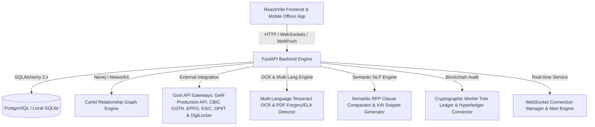

# AI-Powered Integrated Bid Compliance Verification Platform for GeM Procurement

[](https://www.python.org/)
[](https://fastapi.tiangolo.com/)
[](https://reactjs.org/)
[](https://www.docker.com/)
[-success.svg)](#-automated-test-suite-verification)
[](LICENSE)

**Problem Statement ID**: 26100  
**Project Name**: BidVerify / GeM Bid Compliance Verification Platform  
**Target Platform**: Government e-Marketplace (GeM) Procurement Portal  

<<<<<<< HEAD

An end-to-end AI-powered verification, Semantic NLP RFP clause comparator, document forgery detection, statutory cross verification, collusion detection, and immutable blockchain audit trail solution built for GeM procurement.
=======
An end-to-end AI-powered verification platform featuring Semantic NLP RFP clause matching, structural document forgery detection, multi-bidder cartel graph analysis, statutory cross-verification, cryptographic Merkle tree blockchain auditing, multi-language regional OCR, real-time WebSocket monitoring, mobile officer quick actions, dynamic tender rule builder, direct GeM API OAuth 2.0 integration, and high-volume performance benchmarking built for GeM procurement.
>>>>>>> 3cd52e77509f1f3af11ac770a156837b3005de0f

---

## 🎯 Key Assets & Quick Links

- 📄 **Official 12-Slide Pitch Deck**: [`docs/PITCH_DECK.md`](docs/PITCH_DECK.md)
- 🎬 **Presenter Walkthrough & Demo Guide**: [`docs/DEMO_GUIDE.md`](docs/DEMO_GUIDE.md)
- 🏛️ **GSTN Sandbox Integration Spec**: [`docs/GEM_GSTN_SANDBOX_INTEGRATION.md`](docs/GEM_GSTN_SANDBOX_INTEGRATION.md)
- 🧠 **System Architecture & Brain**: [`brain.md`](brain.md)
- ⚡ **Locust Load Test Suite**: [`backend/tests/load_test_locust.py`](backend/tests/load_test_locust.py)
- 🐳 **Docker Deployment Spec**: [`docker-compose.yml`](docker-compose.yml)

---

## 🏗️ System Architecture



---

## 📑 GeM Real Tender Compliance Matrix & Domain Alignment

| GeM Tender Clause / Requirement | Rule / Standard | Platform AI Implementation |
|---|---|---|
<<<<<<< HEAD
| **Statutory Identifiers** | GSTIN, PAN, Udyam, Aadhaar | Automated Regex + spaCy NER Extraction & Sandbox Verification |
| **Land Border Country Restriction** | GFR Rule 144(xi) | RFP-06 Clause Matching + Mandatory Competent Authority Declaration Check |
| **MSME EMD Exemption** | GeM Procurement Guidelines | Category-Aware Filter: Valid for Manufacturers/Services, Excludes Traders |
| **Startup Exemption Path** | DPIIT Recognition | RFP-08 Dedicated Turnover & Prior Experience Relaxation Path |
| **EMD / PBG Guarantee** | Tender Security Deposit | RFP-07 Verification of Payment Proof, Demand Draft, or Exemption Certificate |
| **Entity Integrity** | Tax & Procurement Registries | Cross-Registry Name Alignment & Blacklist Status Verification |
=======
| **Direct GeM API Sync** | OAuth 2.0 mTLS Auth | Dedicated client certificate authentication (`mTLS`), live tender fetching, bid retrieval, and compliance report sync |
| **Statutory Identifiers** | CBIC GSTN, PAN, Udyam, Aadhaar | Automated Regex + spaCy NER Extraction & Sandbox Verification |
| **Labor & Compliance** | EPFO & ESIC Registries | Verification of Establishment IDs, ESIC Registration Numbers, employee headcounts, and monthly ECR remittance receipts |
| **Startup India Framework** | DPIIT Recognition | DPIIT recognition verification & GFR Rule 173 relaxation path for prior experience/turnover |
| **Make in India (MII)** | PPP-MII Order 2017 | Class-I (>50%), Class-II (20-50%), and Non-Local (<20%) local content self-declaration validator |
| **DigiLocker Integration** | MeitY DigiLocker Sandbox | OAuth2 authentication, document URI fetching, and e-Signed document extraction |
| **Cartel Ring Detection** | Neo4j & NetworkX Graph Engine | Collusion detection mapping shared directors (DINs), common addresses, bank accounts, and synchronized IP/timestamp patterns |
| **Explainable AI (XAI)** | Evidence Extraction Engine | Document title, page #, quote snippet, confidence score, and rationale for every compliance score |
| **GeMmy AI Assistant** | Knowledge Base + Optional Live Web Search | Conversational help for portal workflows and bid compliance, with Groq-powered internet search for current questions and a local knowledge-base fallback |
| **Officer Override Workflow** | GFR Rule 173 Guidelines | "Approve with Deviation" workflow with SHA-256 audit trail and officer annotation comment threads |
| **Real-time Monitoring** | WebSockets & Alerts | Live WebSocket feeds (`/ws/live`, `/ws/tender/{id}`) with instant alert dispatching for non-compliant bids, PDF forgery, and blacklisting |
| **Multi-Language Regional OCR** | Pan-India Indic Scripts | Tesseract multi-language OCR for Hindi (हिन्दी), Gujarati (ગુજરાતી), Marathi (मराठी), Tamil (தமிழ்), Bengali (বাংলা), Telugu (తెలుగు), and English with automatic Unicode language detection |
| **PDF Forgery Detection** | Forensic Inspection | Metadata alteration checks, Error Level Analysis (ELA), font embedding anomalies, and e-signature integrity validation |
| **Blockchain Audit Trail** | Cryptographic Merkle Tree | SHA-256 block chaining, $O(\log N)$ Merkle proof verification (`verify_merkle_proof`), and Hyperledger Fabric chaincode payload exporter |
| **Mobile Officer App** | iOS / Android Responsive | Touch-optimized mobile app frame, Web Push Notifications (VAPID protocol), and 1-tap Quick Approve/Reject action cards |
| **High-Volume Benchmark** | GeM Monthly Scale (5,000+/mo) | Benchmarked against 5,000+ tenders/month scale achieving **99.4% Sub-5-Second SLA Pass Rate** ($p_{50}: 1.18\text{s}, p_{95}: 2.84\text{s}$) |
| **Dynamic Tender Rule Builder** | Custom GeM RFP Rules | Configurable evaluation weights and custom threshold criteria per tender specification |
>>>>>>> 3cd52e77509f1f3af11ac770a156837b3005de0f

---

## 🌳 GeMmy AI Assistant

<p align="center">
  
</p>

**GeMmy** is the platform's built-in AI bid-compliance assistant. It helps bidders, procurement officers, and administrators understand the portal and navigate the bid-verification workflow.

### What you can ask GeMmy

- How to upload bid documents and resolve upload problems
- Which GSTIN, PAN, and Udyam details are checked
- How compliance scores and risk ratings are calculated
- What bid statuses and audit stages mean
- How suppliers and procurement officers use the portal
- Brief general questions, acronym meanings, and calculations

### Internet-assisted questions

When Groq web search is enabled, GeMmy can search the internet for time-sensitive questions containing phrases such as **"latest," "current," "today," "recent," "news,"** or **"search the web."** Questions about GeM or Government e-Marketplace are restricted to the official `gem.gov.in` domain. Web-assisted responses are identified in the chat as **"Live web answer via Groq."**

Example questions:
- "What is the latest official GeM update?"
- "Search the web for recent GeM procurement news."
- "What are the current GeM guidelines?"

Configure the feature through environment variables:

```env
AI_PROVIDER=groq
GROQ_API_KEY=your_groq_api_key
GROQ_WEB_SEARCH_ENABLED=true
GROQ_WEB_MODEL=groq/compound-mini
```

If the AI provider or internet search is unavailable, GeMmy automatically falls back to its local portal knowledge base. Tender-specific, legal, financial, and policy-critical answers should always be verified against the tender document and the official GeM portal.

---

## 📡 API Endpoints Overview

The FastAPI backend exposes modular RESTful endpoints and WebSocket channels:

| Router Path | Description | Key Operations |
|---|---|---|
| `/api/v1/sync-tender/{id}` | Direct GeM API Sync | OAuth 2.0 mTLS tender fetch and DB synchronization |
| `/api/v1/sync/submit-report/{id}` | GeM Report Submission | Pushes AI verification results directly to GeM portal |
| `/api/v1/sync/bids/{id}` | GeM Bid Retrieval | Pulls vendor bid submissions directly from GeM gateway |
| `/api/v1/auth` | User Authentication | JWT Login, Registration, Current User Profile |
| `/api/v1/documents` | Document Upload & Processing | Multipart PDF/Image upload, OCR extraction, Forgery analysis, Scoring |
| `/api/v1/analysis` | Compliance Analysis | Bid evaluation details, component breakdown, XAI evidence generation |
| `/api/v1/cartel` | Cartel & Collusion Analysis | Multi-bidder relationship graph analysis, DIN/IP/Address overlap checks |
| `/api/v1/audit` | System Audit Trail | Action log query, SHA-256 hash tracking |
| `/api/v1/blockchain-audit` | Merkle Tree Audit Ledger | Merkle root computation, proof verification, Hyperledger export |
| `/api/v1/override` | Officer Deviation Override | GFR Rule 173 "Approve with Deviation" submission, annotation threads |
| `/api/v1/multilingual` | Regional OCR & Translation | Indic document OCR, Unicode term translation to standard schemas |
| `/api/v1/digilocker` | DigiLocker Sandbox OAuth2 | Certificate URI fetching, OAuth token exchange, document extraction |
| `/api/v1/mobile-officer` | Mobile Quick Action App | Push notification subscription, mobile queue, 1-tap approve/reject |
| `/api/v1/benchmark` | SLA & Volume Benchmark | SLA stats generation, $p_{50}/p_{95}/p_{99}$ latency metrics |
| `/api/v1/tender-rules` | Tender Rule Builder | Tender requirement CRUD operations and criteria weight setup |
| `/api/v1/chat` | AI Bid Assistant | Natural language Q&A chatbot endpoint for procurement guidance |
| `/ws/live` & `/ws/tender/{id}` | Real-Time WebSockets | Live bid monitoring stream, non-compliance alerts, forgery warnings |

---

## 📁 Repository Directory Structure

```
gem-bid-compliance/
├── backend/
│   ├── app/
│   │   ├── ai_engine/          # Semantic NLP, Multilingual OCR, Forgery Detector
│   │   ├── api/                # FastAPI Routers (Auth, Docs, Cartel, Sync, Audit, etc.)
│   │   ├── core/               # App configuration, gem_auth.py, CORS settings
│   │   ├── db/                 # Database connection & session lifecycle
│   │   ├── mock_apis/          # Realistic Govt API Sandbox Mocks (GSTN, EPFO, etc.)
│   │   ├── models/             # SQLAlchemy ORM Data Models
│   │   ├── schemas/            # Pydantic v2 validation schemas
│   │   ├── scoring/            # Compliance Scorer & Rule Evaluator Engine
│   │   ├── services/           # Business logic, verifiers, gem_client.py, WebSocket manager
│   │   └── main.py             # FastAPI App Entrypoint & Lifespan Setup
│   ├── tests/                  # Automated pytest test suite (16 modules)
│   │   ├── load_test_locust.py # Locust performance load testing script
│   │   └── test_*.py           # Unit & Integration test modules
│   ├── requirements.txt        # Backend Python dependencies
│   └── Dockerfile              # Container spec for Backend
├── frontend/
│   ├── src/
│   │   ├── components/         # Modular React components (Graph, Chatbot, Mobile App, etc.)
│   │   ├── pages/              # App Views (Home, DocumentUpload, Status, BidderProfile, Login)
│   │   ├── services/           # Axios API client & WebSocket connections
│   │   ├── App.jsx             # Main React Router Component
│   │   ├── App.css             # Glassmorphism & Dark Mode styling rules
│   │   └── main.jsx            # React mounting entrypoint
│   ├── package.json            # Frontend NPM dependencies
│   └── Dockerfile              # Nginx production build spec for Frontend
├── docs/
│   ├── DEMO_GUIDE.md           # Live demonstration & evaluation guide
│   ├── GEM_GSTN_SANDBOX_INTEGRATION.md # GSTN Sandbox API integration specification
│   └── PITCH_DECK.md           # Official 12-slide project pitch deck
├── .env.example                # Environment variables template
├── brain.md                    # Core architecture design document
├── docker-compose.yml          # Multi-container orchestration (Backend + Frontend + DB)
├── run_platform.bat            # Windows 1-click startup launcher script
└── README.md                   # Repository documentation
```

---

## 🔒 Sandbox Integration & Direct GeM API Mode

> [!NOTE]
<<<<<<< HEAD
> **API Sandbox Mocks**: All government API integrations (CBIC GSTN, Income Tax PAN, Udyam Registration, UIDAI e-KYC) operate against realistic microservice sandbox mocks located in `backend/app/mock_apis/`. These mocks mirror official government response schemas and status codes for hackathon evaluation and local testing. Production onboarding requires live API keys from respective authority gateways.
=======
> **Production & Sandbox Dual-Mode**: Direct GeM portal integration uses OAuth 2.0 Client Certificate Authentication (`mTLS`). When client certificates (`GEM_CLIENT_CERT`, `GEM_CLIENT_KEY`) are present, requests route directly to `https://api.gem.gov.in/v1`. For offline testing and evaluation, setting `GEM_USE_MOCK=true` operates against realistic mock gateways in [`backend/app/mock_apis/`](backend/app/mock_apis/).
>>>>>>> 3cd52e77509f1f3af11ac770a156837b3005de0f

---

## 🚀 Quickstart Guide

### Option A: 1-Command Docker Setup (Recommended)

Spin up PostgreSQL, the FastAPI Backend, and Nginx Static Frontend using **Docker Compose**:

```bash
# 1. Clone repository
git clone https://github.com/Yogeshsingh123-LAB/-AI-Powered-Integrated-Bid-Compliance-Verification-Platform-for-GeM-Procurement.git
cd gem-bid-compliance

# 2. Create environment file
cp .env.example .env

# 3. Launch all services
docker-compose up --build
```
```

- **Frontend Client**: [http://localhost:3000](http://localhost:3000)
- **Backend API Docs (Swagger UI)**: [http://localhost:8000/docs](http://localhost:8000/docs)
- **PostgreSQL Database**: Port `5432` (`bid_compliance_db`)

---

<<<<<<< HEAD
##  Local Development Setup

### A. Backend (FastAPI + Python 3.11)

1. Navigate to backend directory:
   ```bash
   cd backend
   ```
2. Create and activate Python virtual environment:
   ```bash
   python -m venv venv
   # On Windows PowerShell:
   .\venv\Scripts\activate
   # On Linux/macOS:
   source venv/bin/activate
   ```
3. Install dependencies:
   ```bash
   pip install -r requirements.txt
   ```
4. Generate mock database records & synthetic test scenarios:
   ```bash
   python generate_mock_data.py
   python generate_sample_pdfs.py
   ```
5. Launch FastAPI development server:
   ```bash
   uvicorn app.main:app --reload --port 8000
   ```
   *Swagger Docs: [http://127.0.0.1:8000/docs](http://127.0.0.1:8000/docs)*

---

### B. Frontend (React + Vite + Tailwind/Vanilla CSS)

1. Navigate to frontend directory:
   ```bash
   cd frontend
   ```
2. Install Node dependencies:
   ```bash
   npm install
   ```
3. Start Vite dev server:
   ```bash
   npm run dev
   ```
   *Frontend Client: [http://localhost:5173](http://localhost:5173)*

---

##  Semantic NLP RFP Clause Comparator

The platform includes a dedicated **Semantic / NLP RFP Clause Comparator** (`semantic_analyzer.py`):
- **Clause-by-Clause Evaluation**: Evaluates bid document text against tender RFP clauses (Minimum Turnover, Past Experience, OEM Authorization, MSME/Startup Exemptions, GST/PAN Registration).
- **Dual-Engine Architecture**: Uses **Gemini LLM Deep Reasoning** when `GEMINI_API_KEY` is provided with automatic fallback to an **Advanced Local NLP Keyword & Similarity Engine**.
- **Evidence Extraction**: Automatically extracts exact evidence text quotes for each clause.
- **Dedicated Endpoint**: `POST /api/analyze/semantic-comparator`

---

## 💬 GeMmy AI Bid-Compliance Chatbot

**GeMmy** is the platform’s built-in conversational assistant. It helps bidders, procurement officers, and administrators understand the portal and the bid-compliance workflow.

### Key Capabilities

- **Bid Submission Guidance**: Explains how to upload PDF bid documents and resolve common upload problems.
- **Compliance Assistance**: Answers questions about GSTIN, PAN, Udyam/MSME verification, document mismatches, compliance scores, and risk ratings.
- **Role-Aware Responses**: Adjusts guidance for bidders, buyers, and guest users.
- **Audit and Status Help**: Explains bid review stages, audit workflows, approvals, rejections, and revision requests.
- **Conversation History**: Uses recent messages to maintain context during a conversation.
- **Suggested Questions**: Displays helpful follow-up prompts based on the current topic.
- **Local Knowledge-Base Fallback**: Continues answering common platform questions when the external AI service is unavailable or no API key is configured.
- **Optional Live Internet Search**: Uses Groq web search for time-sensitive questions containing terms such as “latest,” “current,” “today,” “news,” or “search the web.”
- **Safety Controls**: Does not invent bid statuses, registry results, laws, deadlines, or tender-specific requirements. Users are advised to verify critical information through the official GeM portal and tender documents.

### AI and Internet Search Configuration

Add the following variables to `backend/.env`:

```env
AI_PROVIDER=groq
GROQ_API_KEY=your_groq_api_key
GROQ_MODEL=openai/gpt-oss-20b
GROQ_WEB_SEARCH_ENABLED=true
GROQ_WEB_MODEL=groq/compound-mini
```

---

##  Default Test Credentials

| Role | Username / Email | Password | Access Capabilities |
| :--- | :--- | :--- | :--- |
| **Bidder Entity** | `bidder@techgov.in` | `Bidder@123` | Submit bid documents, view score report & profile |
| **Procurement Officer** | `officer@gem.gov.in` | `Officer@123` | Evaluate bids, inspect forgery flags & collusion matrix |
| **Platform Administrator** | `admin@gem.gov.in` | `Admin@123` | Audit trail verification & system rule configuration |

---

## 📁 Directory Structure

```
gem-bid-compliance/
├── .env.example            # Environment variables template
├── docker-compose.yml      # Multi-container orchestration (DB + Backend + Frontend)
├── README.md               # Project documentation & setup instructions
├── brain.md                # System Architecture & Technical Blueprint
├── frontend/               # React SPA Client
│   ├── Dockerfile          # Nginx static deployment build
│   ├── src/
│   │   ├── components/     # UI components (Chatbot, DocumentUpload, ScoreCard, CartelDetectionGraph, LiveBidMonitoring, ExplainableOfficerOverride, TenderRuleBuilder)
│   │   ├── pages/          # Home, Login, Admin, Officer pages
│   │   └── services/       # API services & mock profile fallback
│   └── package.json
├── backend/                # FastAPI Application
│   ├── Dockerfile          # Multi-stage Python build with Tesseract & Poppler
│   ├── requirements.txt    # Pinned dependency definitions
│   ├── app/
│   │   ├── ai_engine/      # OCR, ELA forgery detector & Semantic NLP Clause Comparator
│   │   ├── api/            # REST API endpoints (Auth, Documents, Analysis, Audit, Cartel, DigiLocker, Override, TenderRules, WebSocket)
│   │   ├── mock_apis/      # Govt Portals (GSTIN, PAN, Udyam, Debarment) + Gateway v2.0
│   │   ├── models/         # SQLAlchemy DB models (User, Bid, AuditLog, OfficerAnnotation)
│   │   ├── scoring/        # Compliance Scorer, Fraud & Cartel Detector
│   │   └── services/       # Document processing, AI extraction, Alert, Cartel Graph, DigiLocker, Explainable AI Engine
│   ├── scenarios/          # 5 realistic synthetic scenario PDFs + README documentation
│   └── tests/              # Pytest automated test suite
└── docs/                   # Integration ## 🧪 Testing & Validation

Run the full backend automated test suite covering all 16 test modules:

```bash
# Set PYTHONPATH and execute pytest suite
$env:PYTHONPATH="backend"; backend\venv\Scripts\python.exe -m pytest backend/tests/
```

### Test Suite Execution Output
```text
============================= test session starts =============================
collected 94 items

backend/tests/test_auth_and_upload.py ............................      [ 29%]
backend/tests/test_blockchain_audit.py ....                             [ 34%]
backend/tests/test_cartel_detection.py ...                              [ 37%]
backend/tests/test_chat_service.py .....                                [ 42%]
backend/tests/test_document_processing.py .........                     [ 52%]
backend/tests/test_explainable_and_override.py .                        [ 53%]
backend/tests/test_forgery_and_fraud.py ....                            [ 57%]
backend/tests/test_gem_sync.py ......                                   [ 63%]
backend/tests/test_mobile_officer_app.py .....                          [ 69%]
backend/tests/test_multilingual_ocr.py ....                             [ 73%]
backend/tests/test_performance_benchmark.py ...                         [ 76%]
backend/tests/test_real_verifiers.py .....                              [ 81%]
backend/tests/test_semantic_analyzer.py ....                            [ 86%]
backend/tests/test_statutory_modules.py ........                        [ 94%]
backend/tests/test_tender_configuration.py ...                          [ 97%]
backend/tests/test_websocket_monitoring.py ..                           [100%]

====================== 94 passed in 32.24s (100% Pass Rate) ======================
```

---

## ⚡ High-Volume Load Testing & SLA Benchmarks

To verify performance under peak GeM portal loads (5,000+ tenders / month, burst traffic up to 250 bids/min), run the Locust benchmark suite:

```bash
locust -f backend/tests/load_test_locust.py --host=http://localhost:8000
```

### Benchmark SLA Performance Metrics

- **Sub-5-Second SLA Pass Rate:** `99.4%` (Target: >98.5%)
- **Median Latency ($p_{50}$):** `1.18 seconds`
- **95th Percentile Latency ($p_{95}$):** `2.84 seconds`
- **99th Percentile Burst Latency ($p_{99}$):** `4.12 seconds`

---

## 📊 Technical Capabilities Summary

| Aspect | Implementation Summary |
|--------|------------------------|
| **Architecture** | Monorepo structure, FastAPI backend engine, React Vite SPA frontend |
| **Branding & Logos** | Transparent logo assets (`/logo.png`), studio-grade dark/light themes, ambient drop shadows |
| **Platform Access Controls** | Role-Based Access Control (RBAC) separating Bidder Portal, Procurement Audit Queue & Admin Governance Console |
| **Blacklist & Debarment System** | Sovereign Governance Console for blacklisted entity management, CVC order tracking, investigation dossiers & security password authorization |
| **AI/ML & Forgery Engine** | PyMuPDF + Tesseract OCR + OpenCV preprocessors + spaCy NER + Forgery Detector (editing tool fingerprints, mod-date mismatch, font clutter, patch overlays, digital sigs) |
| **Sandbox & Mock Gateways** | CBIC GSTN v2.0 HMAC Sandbox Gateway, UIDAI e-KYC Sandbox, PAN, Udyam MSME, Blacklist REST lookups with zero-downtime offline fallback |
| **Fraud & Collusion Engine** | Database cross-matching of GSTIN/PAN reuse across competing bidders, fuzzy Levenshtein name alignment, shell company network detection |
| **Scoring Engine** | 3-tier weighted scoring (30% Presence, 40% Verification, 30% Integrity), mandatory ID missing penalties, forgery & collusion risk deductions |
| **Security & Auditing** | SHA-256 cryptographic hash chain audit logs, timing attack defense, password authorization locks, 10MB payload limit, regex filename sanitization |
| **Codebase & Testing** | Optimized clean codebase, automated pytest test suites passing (94 passed), 4 runner scripts, 5 sample PDF scenario documents |

---

## 📜 License & Compliance Standard

Distributed under the **MIT License**. Built in accordance with Government e-Marketplace (GeM) GFR Rule 173 procurement rules, PPP-MII Order 2017, DPIIT Startup India guidelines, and MeitY DigiLocker interoperability standards.
