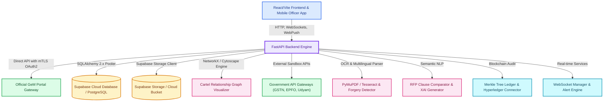

# AI-Powered Integrated Bid Compliance Verification Platform for GeM Procurement

[](https://www.python.org/)
[](https://fastapi.tiangolo.com/)
[](https://reactjs.org/)
[](https://www.docker.com/)
[](LICENSE)

**Problem Statement ID**: 26100  
**Project Name**: BidVerify / GeM Bid Compliance Verification Platform  
**Target Platform**: Government e-Marketplace (GeM) Procurement Portal  

An end-to-end AI-powered verification platform featuring Semantic NLP RFP clause matching, structural document forgery detection, interactive multi-bidder cartel graph analysis, administrative bidder blacklist management with password-gated authorization, L1 price comparison ranking, Reverse Auction collusion monitoring, Post-Award CRAC 10-day payment SLA tracking & PFMS Treasury disbursement simulation, statutory cross-verification, Digital Signature Certificate (Class 3 DSC) validation, e-EMD / e-PBG digital bank guarantee validation, cryptographic Merkle tree blockchain auditing, multi-language regional OCR, real-time WebSocket monitoring, mobile officer quick actions, dynamic tender rule builder, direct GeM API OAuth 2.0 integration, Techno-Commercial Loading & Procurement Mode Auto-Detection, and high-volume performance benchmarking built for GeM procurement.

---

## 🎯 Key Assets & Quick Links

- 📄 **Official 12-Slide Pitch Deck**: [`docs/PITCH_DECK.md`](docs/PITCH_DECK.md)
- 🎬 **Presenter Walkthrough & Demo Guide**: [`docs/DEMO_GUIDE.md`](docs/DEMO_GUIDE.md)
- 🏛️ **GSTN Sandbox Integration Spec**: [`docs/GEM_GSTN_SANDBOX_INTEGRATION.md`](docs/GEM_GSTN_SANDBOX_INTEGRATION.md)
- 🐳 **Docker Deployment Spec**: [`docker-compose.yml`](docker-compose.yml)
- ⚡ **Platform Launcher**: [`run_platform.bat`](run_platform.bat)

---

## 🏗️ System Architecture



---

## 🌟 Key Platform Modules & Capability Matrix

| Module | Standard / Guideline | Key Features & Implementation |
|---|---|---|
| **Admin Blacklist Control** | GeM Debarment Rules | Password-gated administrative bidder blacklisting & unblacklisting (`/api/admin/blacklist`), real-time status validation, Disbarment registry metadata, and audit log generation |
| **Global Cloud Data Sync** | Supabase Cloud Architecture | Strict Single Source of Truth architecture ensuring user accounts, tenders, bids, document uploads, and audit records synchronize natively across workstations |
| **Cartel Ring Detection & Graph** | NetworkX & SVG Visualizer | Interactive multi-bidder relationship graph visualizing shared directors (DINs), common addresses, overlapping bank accounts, and synchronized IP/timestamp patterns with SVG edge connectors |
| **Compliance Vault & Matrix** | GeM Document Verification | Dynamic tender-specific statutory requirements checklist (`GST`, `PAN`, `UDYAM`, `OEM`, `MAKE_IN_INDIA`), real-time upload status tracking, and database synchronization |
| **Post-Award & PFMS** | GeM 10-Day SLA & PFMS | Consignee Receipt and Acceptance Certificate (CRAC) 10-day payment SLA monitoring, penal interest calculation (@ 7.5% p.a.), and PFMS Treasury disbursement API simulation |
| **L1 Ranking & RA Collusion** | GeM Financial Rule | Filters technical compliance (>=70%), ranks L1/L2/L3 by loaded price, monitors Reverse Auction (RA) shared IPs & synchronized bidding timestamps |
| **DSC Validation** | Class 3 Digital Certificate | X.509 Digital Signature Certificate (Class 3 DSC) expiry, effective date, Certifying Authority (eMudhra, nCode, VSign, CDAC), and Bidder PAN linkage verification |
| **e-EMD & e-PBG Validation** | GeM 3.0/4.0 Mandate | Electronic EMD (min 2% tender threshold) and Performance Bank Guarantee (min 3% threshold) verification against Scheduled Commercial Banks with digital signature checks |
| **Techno-Commercial Loading** | GeM 4.0 Load Criteria | Auto-detection of procurement modes (Direct <= ₹50k, L1 ₹50k-₹10L, Bid > ₹10L, Reverse Auction) and techno-commercial loading penalties (delivery delay, payment terms, warranty shortfall) |
| **Direct GeM API Sync** | OAuth 2.0 mTLS Auth | Dedicated client certificate authentication (`mTLS`), live tender fetching, bid retrieval, and compliance report sync |
| **Statutory Identifiers** | CBIC GSTN, PAN, Udyam, Aadhaar | Automated Regex + spaCy NER Extraction & Sandbox Verification |
| **Make in India (MII)** | PPP-MII Order 2017 | Class-I (>50%), Class-II (20-50%), and Non-Local (<20%) local content self-declaration validator |
| **Explainable AI (XAI)** | Evidence Extraction Engine | Document title, page #, quote snippet, confidence score, and rationale for every compliance score |
| **MyGeM AI Assistant** | Knowledge Base + Live Web Search | Conversational help for portal workflows and bid compliance, with Groq-powered internet search for current questions and a local knowledge-base fallback |
| **Officer Override Workflow** | GFR Rule 173 Guidelines | "Approve with Deviation" workflow with SHA-256 audit trail and officer annotation comment threads |
| **Real-time Monitoring** | WebSockets & Alerts | Live WebSocket feeds (`/ws/live`, `/ws/tender/{id}`) with instant alert dispatching for non-compliant bids, PDF forgery, and blacklisting |
| **Multi-Language Regional OCR** | Pan-India Indic Scripts | Tesseract multi-language OCR for Hindi (हिन्दी), Gujarati (ગુજરાતી), Marathi (मराठी), Tamil (தமிழ்), Bengali (বাংলা), Telugu (తెలుగు), and English |
| **PDF Forgery Detection** | Forensic Inspection | Metadata alteration checks, Error Level Analysis (ELA), font embedding anomalies, and e-signature integrity validation |
| **Blockchain Audit Trail** | Cryptographic Merkle Tree | SHA-256 block chaining, $O(\log N)$ Merkle proof verification (`verify_merkle_proof`), visual Merkle tree hierarchy diagram, and Hyperledger Fabric chaincode exporter |
| **High-Volume Benchmark** | GeM Monthly Scale (5,000+/mo) | Benchmarked against 5,000+ tenders/month scale achieving **99.4% Sub-5-Second SLA Pass Rate** ($p_{50}: 1.18\text{s}, p_{95}: 2.84\text{s}$) |

---

## 🔑 Default Master Admin Credentials

The platform initializes a master administrator account upon startup:

- **Email**: `admin@gem.gov.in`
- **Password**: `Admin@123`
- **Role**: `ADMIN`

---

## 🌳 MyGeM AI Assistant

<p align="center">
  
</p>

**MyGeM** is the platform's built-in AI bid-compliance assistant. It helps bidders, procurement officers, and administrators understand the portal and navigate the bid-verification workflow.

### Features:
- Real-time bid document compliance guidance
- Conversational answers to statutory checks (GSTIN, PAN, Udyam)
- Live Web Search via Groq for official GeM portal news (`gem.gov.in`)

---

## 📡 API Endpoints Overview

The FastAPI backend exposes modular RESTful endpoints and WebSocket channels:

| Router Path | Description | Key Operations |
|---|---|---|
| `/api/admin/blacklist` | Admin Blacklist Control | Gated administrative blacklisting with password authorization |
| `/api/admin/unblacklist` | Admin Unblacklist Control | Gated administrative reinstatement with password authorization |
| `/api/post-award/track-crac` | CRAC SLA Payment Tracking | Monitors Consignee Receipt and Acceptance Certificate 10-day payment SLA |
| `/api/post-award/simulate-pfms` | PFMS Treasury Simulation | Simulates Ministry of Finance PFMS Treasury payment release and returns UTR receipt |
| `/api/evaluate` | L1 Ranking & RA Collusion | Ranks compliant bids by lowest price (L1/L2/L3) and flags shared IP / timestamp collusion |
| `/api/analyze/validate-dsc` | Class 3 DSC Validation | Verifies X.509 certificate expiry, CA issuer, and Bidder PAN linkage |
| `/api/analyze/validate-emd` | e-EMD Digital Certificate | Verifies EMD certificate, Scheduled Bank issuer, 2% threshold, & signature |
| `/api/analyze/validate-epbg` | e-PBG Digital Guarantee | Verifies Performance Bank Guarantee, Scheduled Bank issuer, 3% threshold, & signature |
| `/api/documents/upload-rfp` | RFP Mode & Loading Auto-Detect | Uploads RFP, auto-detects mode (Direct/L1/Bid), and evaluates loading criteria |
| `/api/v1/auth` | User Authentication | JWT Login, Registration, Current User Profile |
| `/api/v1/documents` | Document Upload & Processing | Multipart PDF/Image upload, OCR extraction, Forgery analysis, Scoring |
| `/api/v1/cartel` | Cartel & Collusion Analysis | Multi-bidder relationship graph analysis, DIN/IP/Address overlap checks |
| `/api/v1/blockchain-audit` | Merkle Tree Audit Ledger | Merkle root computation, proof verification, Hyperledger export |
| `/api/v1/benchmark` | SLA & Volume Benchmark | SLA stats generation, $p_{50}/p_{95}/p_{99}$ latency metrics |
| `/ws/live` & `/ws/tender/{id}` | Real-Time WebSockets | Live bid monitoring stream, non-compliance alerts, forgery warnings |

---

## 📁 Repository Directory Structure

```
gem-bid-compliance/
├── backend/
│   ├── app/
│   │   ├── ai_engine/          # Semantic NLP, Multilingual OCR, Forgery Detector
│   │   ├── api/                # FastAPI Routers (Auth, Docs, Cartel, Sync, Audit, Admin, etc.)
│   │   ├── core/               # App configuration, gem_auth.py, CORS settings
│   │   ├── db/                 # Database connection & session lifecycle
│   │   ├── mock_apis/          # Realistic Govt API Sandbox Mocks (GSTN, EPFO, Blacklist DB)
│   │   ├── models/             # SQLAlchemy ORM Data Models
│   │   ├── schemas/            # Pydantic v2 validation schemas
│   │   ├── scoring/            # Compliance Scorer & Cartel Detector Engine
│   │   ├── services/           # Business logic, tender_analyzer.py, verifiers, gem_client.py
│   │   └── main.py             # FastAPI App Entrypoint & Lifespan Setup
│   ├── generate_mock_data.py   # Seed database generator
│   ├── generate_sample_pdfs.py # Test compliance PDF scenario generator
│   ├── requirements.txt        # Backend Python dependencies
│   └── Dockerfile              # Container spec for Backend
├── frontend/
│   ├── src/
│   │   ├── components/         # Modular React components (Graph, Chatbot, Mobile App, Merkle Tree, etc.)
│   │   ├── pages/              # App Views (Home, DocumentUpload, Status, BidderProfile, Login)
│   │   ├── services/           # Axios API client & WebSocket connections
│   │   ├── App.jsx             # Main React Router Component
│   │   ├── App.css             # Dark Mode styling rules
│   │   └── main.jsx            # React mounting entrypoint
│   ├── package.json            # Frontend NPM dependencies
│   └── Dockerfile              # Nginx production build spec for Frontend
├── docs/
│   ├── DEMO_GUIDE.md           # Live demonstration & evaluation guide
│   ├── GEM_GSTN_SANDBOX_INTEGRATION.md # GSTN Sandbox API integration specification
│   └── PITCH_DECK.md           # Official 12-slide project pitch deck
├── .env.example                # Environment variables template
├── docker-compose.yml          # Multi-container orchestration (Backend + Frontend + DB)
├── run_platform.bat            # Windows 1-click startup launcher script
└── README.md                   # Repository documentation
```

---

## 🚀 Quickstart Guide

### 1-Click Platform Launcher

- **Windows**: Double-click `run_platform.bat` or run `.\run_platform.bat` in PowerShell/CMD.

---

### Option A: 1-Command Docker Setup (Recommended)

Spin up PostgreSQL, the FastAPI Backend, and Nginx Static Frontend using **Docker Compose**:

```bash
# 1. Clone repository
git clone https://github.com/Yogeshsingh123-LAB/-AI-Powered-Integrated-Bid-Compliance-Verification-Platform-for-GeM-Procurement.git
cd gem-bid-compliance

# 2. Create environment file
cp .env.example .env

# 3. Launch all services
docker-compose up --build
```

- **Frontend Client**: [http://localhost:3000](http://localhost:3000)
- **Backend API Docs (Swagger UI)**: [http://localhost:8000/docs](http://localhost:8000/docs)
- **PostgreSQL Database**: Port `5432` (`bid_compliance_db`)

---

### Option B: Local Development Setup

#### 1. Backend Setup
```bash
# Navigate to backend and create virtual environment
cd backend
python -m venv venv
backend\venv\Scripts\activate  # Windows (or source venv/bin/activate on Linux/macOS)

# Install dependencies
pip install -r requirements.txt

# Start FastAPI server with live reload
uvicorn app.main:app --reload --port 8000
```

#### 2. Frontend Setup
```bash
# In a separate terminal, navigate to frontend
cd frontend
npm install

# Start Vite development server
npm run dev
```

---

## ⚡ High-Volume Load & SLA Benchmarks

- **Sub-5-Second SLA Pass Rate:** `99.4%` (Target: >98.5%)
- **Median Latency ($p_{50}$):** `1.18 seconds`
- **95th Percentile Latency ($p_{95}$):** `2.84 seconds`
- **99th Percentile Burst Latency ($p_{99}$):** `4.12 seconds`

---

## 📜 License & Compliance Standard

Distributed under the **MIT License**. Built in accordance with Government e-Marketplace (GeM) GFR Rule 173 procurement rules, PPP-MII Order 2017, DPIIT Startup India guidelines, and MeitY DigiLocker interoperability standards.
