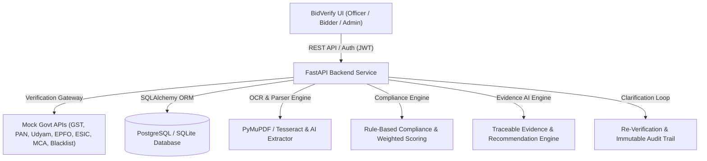

# BidVerify — AI-Powered Integrated Bid Compliance Verification Platform for GeM Procurement

[](https://www.python.org/)
[](https://fastapi.tiangolo.com/)
[](https://reactjs.org/)
[](https://vitejs.dev/)
[](LICENSE)

**Problem Statement ID**: SIH26100  
**Project Name**: BidVerify / GeM Integrated Bid Compliance Verification Platform  
**Target Platform**: Government e-Marketplace (GeM) Procurement Portal  

> [!IMPORTANT]
> **Core Product Principle**: BidVerify is an **AI-assisted decision-support & verification platform**. The AI NEVER independently qualifies or disqualifies a bidder. All final qualification and disqualification decisions remain exclusively with the Procurement Officer.

---

## 🚀 Key Platform Features

### 1. 6-Step Guided Tender Creation Wizard
- **Step 1 — Basic Information**: Tender ID, Reference Number, Title, Department, Category, Description, Estimated Value, Publication & Submission Deadlines.
- **Step 2 — Statutory Eligibility Requirements**: Configure GST, PAN, Udyam, Income Tax, EPFO, ESIC, Make in India, OEM Authorization, Blacklisting requirements.
- **Step 3 — Required Documents**: Configure allowed file formats (`.pdf`, `.png`, `.jpg`), max file sizes, and expiry validation toggles.
- **Step 4 — Verification Rules**: Toggle Government API portal lookup, OCR extraction, AI field parsing, cross-doc matching, fuzzy name matching, registration number validation, and blacklist registry checks.
- **Step 5 — Configurable Scoring Weights & Risk Thresholds**: Scoring weights summing to 100 points, configurable risk level score bands (`LOW`: 90–100, `MEDIUM`: 75–89, `HIGH`: 50–74, `CRITICAL`: 0–49).
- **Step 6 — Review & Publish**: Summary card before publishing.

---

### 2. AI Tender Requirement Analyzer Service
- Analyzes tender description, title, category, estimated value, and additional conditions.
- Intelligently suggests required documents, compliance checks, and scoring weights (summing to 100).
- Categorizes requirements into `MANDATORY` (for explicit rules), `OPTIONAL`, and `REVIEW_REQUIRED` (for inferred requirements).
- Provides tender-specific explanations for every recommendation.

---

### 3. Verification Gateway (Mock Government APIs)
Provides modular verification endpoints simulating live government portals:
- `GET /api/verify/gst/{gstin}` — GSTN Portal active status & return filings
- `GET /api/verify/pan/{pan}` — Income Tax PAN registry & legal name
- `GET /api/verify/udyam/{udyam_id}` — Udyam MSME category & status
- `GET /api/verify/mca/{cin}` — MCA21 corporate incorporation status
- `GET /api/verify/epfo/{epfo_id}` — EPFO employer compliance & remittance status
- `GET /api/verify/esic/{esic_id}` — ESIC employer status
- `GET /api/verify/startup/{dippt_id}` — Startup India recognition status
- `GET /api/verify/nsic/{nsic_id}` — NSIC registration status
- `GET /api/verify/blacklist/{identifier}` — Central Debarment Database lookup
- `GET /api/verify/digilocker/{doc_id}` — DigiLocker official document verification

---

### 4. Evidence-First AI & Bidder Verification View
- Displays overall compliance score dial (`86 / 100`), risk classification (`MEDIUM`), and status (`UNDER REVIEW`).
- Interactive requirement checklist showing `✓ VERIFIED`, `⚠ NEEDS REVIEW`, and `❌ MISSING / FAILED`.
- Clickable Evidence Modal displaying: *WHAT was checked*, *WHERE checked*, *Extracted vs Registry Data*, *RESULT*, *WHEN verified*, and *WHAT officer should do next*.
- AI recommendation outputs `"Procurement Officer Review Required"`.

---

### 5. Clarification & Re-Verification Loop
1. Procurement Officer flags a requirement (e.g. OEM Authorization) and sends clarification instructions.
2. Bidder receives in-app notification & uploads replacement document.
3. System automatically re-runs OCR -> Extraction -> Mock Gateway Lookup -> Cross-matching -> Scoring.
4. Score updates (e.g. 78/100 -> 94/100), risk changes (MEDIUM -> LOW), officer is notified, and complete versioned audit log is preserved.

---

### 6. Role-Based Workflows
- **Procurement Officer**: Create/configure tenders, view submitted bidders, run/re-run verification, review AI findings & evidence, request clarification, approve/reject requirements, make final qualification decision, view audit trail.
- **Bidder**: Explore active tenders, apply to tender, drag-and-drop document uploader with real-time status & replacement controls, view compliance status, respond to clarification requests.
- **Admin**: User management, verification gateway providers, compliance rules, system-wide audit logs, mock database configuration.

---

## MyGeM AI Assistant

**MyGeM** is BidVerify's built-in conversational assistant for bidders, procurement officers, and administrators. Available after login, it helps users understand portal workflows, bid documents, and compliance requirements.

### Features

- **Bid compliance guidance**: Answers questions about document requirements and statutory identifiers such as GSTIN, PAN, and Udyam.
- **AI answers and live web search**: Uses Groq for conversational responses and, when configured and enabled, web search for current questions. A local knowledge base provides fallback guidance when the AI service is unavailable.
- **Multilingual conversations**: Offers automatic language detection and a language selector, including regional Indian languages.
- **Readable responses and calculations**: Supports bold formatting and instructions for clear, plain-text calculation answers.
- **Application tracking and support**: Provides dedicated menus for application tracking, support tickets, and live support, with a support inbox for administrators.
- **Chat controls**: Lets users start a new conversation and adjust the chat window.

MyGeM provides guidance; final bidder qualification and disqualification decisions remain with the Procurement Officer.

---

## 🎯 Key Assets & Quick Links

- 📄 **Implementation Plan**: [`implementation_plan.md`](implementation_plan.md)
- 🎬 **Walkthrough & Demo Guide**: [`walkthrough.md`](walkthrough.md)
- ⚡ **Platform Launcher Scripts**: [`run_platform.ps1`](run_platform.ps1) & [`run_platform.bat`](run_platform.bat)

---

## 🏗️ System Architecture



---

## 🚀 Running the Platform Locally

### Windows Quick Launcher
Double-click `run_platform.bat` or execute in PowerShell:
```powershell
.\run_platform.ps1
```

### Manual Execution

#### 1. Backend Service
```bash
cd backend
python -m venv venv
venv\Scripts\activate
pip install -r requirements.txt
python -m uvicorn app.main:app --reload --port 8000
```

#### 2. Frontend Application
```bash
cd frontend
npm install
npm run dev
```

Open your browser at `http://localhost:5173`.

---

## 🧪 Running Tests

### Backend Test Suite
```bash
cd backend
venv\Scripts\activate
pytest
```

### Frontend Build Check
```bash
cd frontend
npm run build
```

---

## 🔑 Default Administrator Credentials
- **Email**: `admin@bidverify.gov.in`
- **Password**: Configurable via `INITIAL_ADMIN_PASSWORD` in `.env`
