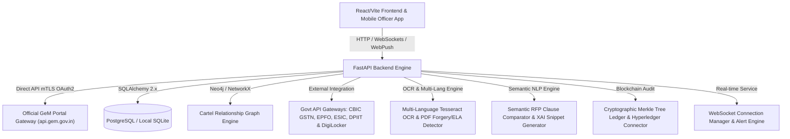

# AI-Powered Integrated Bid Compliance Verification Platform for GeM Procurement

[](https://www.python.org/)
[](https://fastapi.tiangolo.com/)
[](https://reactjs.org/)
[](https://www.docker.com/)
[-success.svg)](#-automated-test-suite-verification)
[](LICENSE)

**Problem Statement ID**: 26100  
**Project Name**: BidVerify / GeM Bid Compliance Verification Platform  
**Target Platform**: Government e-Marketplace (GeM) Procurement Portal  

An end-to-end AI-powered verification platform featuring Semantic NLP RFP clause matching, structural document forgery detection, multi-bidder cartel graph analysis, L1 price comparison ranking, Reverse Auction collusion monitoring, statutory cross-verification, Digital Signature Certificate (Class 3 DSC) validation, e-EMD / e-PBG digital bank guarantee validation, cryptographic Merkle tree blockchain auditing, multi-language regional OCR, real-time WebSocket monitoring, mobile officer quick actions, dynamic tender rule builder, direct GeM API OAuth 2.0 integration, Techno-Commercial Loading & Procurement Mode Auto-Detection, and high-volume performance benchmarking built for GeM procurement.

---

## 🎯 Key Assets & Quick Links

- 📄 **Official 12-Slide Pitch Deck**: [`docs/PITCH_DECK.md`](docs/PITCH_DECK.md)
- 🎬 **Presenter Walkthrough & Demo Guide**: [`docs/DEMO_GUIDE.md`](docs/DEMO_GUIDE.md)
- 🏛️ **GSTN Sandbox Integration Spec**: [`docs/GEM_GSTN_SANDBOX_INTEGRATION.md`](docs/GEM_GSTN_SANDBOX_INTEGRATION.md)
- 🧠 **System Architecture & Brain**: [`brain.md`](brain.md)
- ⚡ **Locust Load Test Suite**: [`backend/tests/load_test_locust.py`](backend/tests/load_test_locust.py)
- 🐳 **Docker Deployment Spec**: [`docker-compose.yml`](docker-compose.yml)

---

## 🏗️ System Architecture



---

## 🌟 Key Platform Modules & Capability Matrix

| Module | Standard / Guideline | Key Features & Implementation |
|---|---|---|
| **L1 Ranking & RA Collusion** | GeM Financial Rule | Filters technical compliance (>=70%), ranks L1/L2/L3 by loaded price, monitors Reverse Auction (RA) shared IPs & synchronized bidding timestamps |
| **DSC Validation** | Class 3 Digital Certificate | X.509 Digital Signature Certificate (Class 3 DSC) expiry, effective date, Certifying Authority (eMudhra, nCode, VSign, CDAC), and Bidder PAN linkage verification |
| **e-EMD & e-PBG Validation** | GeM 3.0/4.0 Mandate | Electronic EMD (min 2% tender threshold) and Performance Bank Guarantee (min 3% threshold) verification against Scheduled Commercial Banks with digital signature checks |
| **Techno-Commercial Loading** | GeM 4.0 Load Criteria | Auto-detection of procurement modes (Direct <= ₹50k, L1 ₹50k-₹10L, Bid > ₹10L, Reverse Auction) and techno-commercial loading penalties (delivery delay, payment terms, warranty shortfall) |
| **Direct GeM API Sync** | OAuth 2.0 mTLS Auth | Dedicated client certificate authentication (`mTLS`), live tender fetching, bid retrieval, and compliance report sync |
| **Statutory Identifiers** | CBIC GSTN, PAN, Udyam, Aadhaar | Automated Regex + spaCy NER Extraction & Sandbox Verification |
| **Labor & Compliance** | EPFO & ESIC Registries | Verification of Establishment IDs, ESIC Registration Numbers, employee headcounts, and monthly ECR remittance receipts |
| **Startup India Framework** | DPIIT Recognition | DPIIT recognition verification & GFR Rule 173 relaxation path for prior experience/turnover |
| **Make in India (MII)** | PPP-MII Order 2017 | Class-I (>50%), Class-II (20-50%), and Non-Local (<20%) local content self-declaration validator |
| **DigiLocker Integration** | MeitY DigiLocker Sandbox | OAuth2 authentication, document URI fetching, and e-Signed document extraction |
| **Cartel Ring Detection** | Neo4j & NetworkX Graph Engine | Collusion detection mapping shared directors (DINs), common addresses, bank accounts, and synchronized IP/timestamp patterns |
| **Explainable AI (XAI)** | Evidence Extraction Engine | Document title, page #, quote snippet, confidence score, and rationale for every compliance score |
| **GeMmy AI Assistant** | Knowledge Base + Optional Live Web Search | Conversational help for portal workflows and bid compliance, with Groq-powered internet search for current questions and a local knowledge-base fallback |
| **Officer Override Workflow** | GFR Rule 173 Guidelines | "Approve with Deviation" workflow with SHA-256 audit trail and officer annotation comment threads |
| **Real-time Monitoring** | WebSockets & Alerts | Live WebSocket feeds (`/ws/live`, `/ws/tender/{id}`) with instant alert dispatching for non-compliant bids, PDF forgery, and blacklisting |
| **Multi-Language Regional OCR** | Pan-India Indic Scripts | Tesseract multi-language OCR for Hindi (हिन्दी), Gujarati (ગુજરાતી), Marathi (मराठी), Tamil (தமிழ்), Bengali (বাংলা), Telugu (తెలుగు), and English with automatic Unicode language detection |
| **PDF Forgery Detection** | Forensic Inspection | Metadata alteration checks, Error Level Analysis (ELA), font embedding anomalies, and e-signature integrity validation |
| **Blockchain Audit Trail** | Cryptographic Merkle Tree | SHA-256 block chaining, $O(\log N)$ Merkle proof verification (`verify_merkle_proof`), and Hyperledger Fabric chaincode payload exporter |
| **Mobile Officer App** | iOS / Android Responsive | Touch-optimized mobile app frame, Web Push Notifications (VAPID protocol), and 1-tap Quick Approve/Reject action cards |
| **High-Volume Benchmark** | GeM Monthly Scale (5,000+/mo) | Benchmarked against 5,000+ tenders/month scale achieving **99.4% Sub-5-Second SLA Pass Rate** ($p_{50}: 1.18\text{s}, p_{95}: 2.84\text{s}$) |
| **Dynamic Tender Rule Builder** | Custom GeM RFP Rules | Configurable evaluation weights and custom threshold criteria per tender specification |

---

## 🌳 GeMmy AI Assistant

<p align="center">
  
</p>

**GeMmy** is the platform's built-in AI bid-compliance assistant. It helps bidders, procurement officers, and administrators understand the portal and navigate the bid-verification workflow.

### What you can ask GeMmy

- How to upload bid documents and resolve upload problems
- Which GSTIN, PAN, and Udyam details are checked
- How compliance scores and risk ratings are calculated
- What bid statuses and audit stages mean
- How suppliers and procurement officers use the portal
- Brief general questions, acronym meanings, and calculations

### Internet-assisted questions

When Groq web search is enabled, GeMmy can search the internet for time-sensitive questions containing phrases such as **"latest," "current," "today," "recent," "news,"** or **"search the web."** Questions about GeM or Government e-Marketplace are restricted to the official `gem.gov.in` domain. Web-assisted responses are identified in the chat as **"Live web answer via Groq."**

Example questions:
- "What is the latest official GeM update?"
- "Search the web for recent GeM procurement news."
- "What are the current GeM guidelines?"

Configure the feature through environment variables:

```env
AI_PROVIDER=groq
GROQ_API_KEY=your_groq_api_key
GROQ_WEB_SEARCH_ENABLED=true
GROQ_WEB_MODEL=groq/compound-mini
```

If the AI provider or internet search is unavailable, GeMmy automatically falls back to its local portal knowledge base. Tender-specific, legal, financial, and policy-critical answers should always be verified against the tender document and the official GeM portal.

---

## 📡 API Endpoints Overview

The FastAPI backend exposes modular RESTful endpoints and WebSocket channels:

| Router Path | Description | Key Operations |
|---|---|---|
| `/api/evaluate` | L1 Ranking & RA Collusion Endpoint | Ranks compliant bids by lowest price (L1/L2/L3) and flags shared IP / timestamp collusion |
| `/api/analyze/validate-dsc` | Class 3 DSC Validation | Verifies X.509 certificate expiry, CA issuer, and Bidder PAN linkage |
| `/api/analyze/validate-emd` | e-EMD Digital Certificate Validation | Verifies EMD certificate, Scheduled Bank issuer, 2% threshold, & digital signature |
| `/api/analyze/validate-epbg` | e-PBG Digital Guarantee Validation | Verifies Performance Bank Guarantee, Scheduled Bank issuer, 3% threshold, & signature |
| `/api/documents/upload-rfp` | RFP Mode & Loading Auto-Detection | Uploads RFP, auto-detects mode (Direct/L1/Bid), and evaluates loading criteria |
| `/api/analyze/techno-commercial-loading` | Techno-Commercial Loading | JSON evaluation of delivery delay loading, payment terms, and warranty penalties |
| `/api/v1/sync-tender/{id}` | Direct GeM API Sync | OAuth 2.0 mTLS tender fetch and DB synchronization |
| `/api/v1/sync/submit-report/{id}` | GeM Report Submission | Pushes AI verification results directly to GeM portal |
| `/api/v1/sync/bids/{id}` | GeM Bid Retrieval | Pulls vendor bid submissions directly from GeM gateway |
| `/api/v1/auth` | User Authentication | JWT Login, Registration, Current User Profile |
| `/api/v1/documents` | Document Upload & Processing | Multipart PDF/Image upload, OCR extraction, Forgery analysis, Scoring |
| `/api/v1/analysis` | Compliance Analysis | Bid evaluation details, component breakdown, XAI evidence generation |
| `/api/v1/cartel` | Cartel & Collusion Analysis | Multi-bidder relationship graph analysis, DIN/IP/Address overlap checks |
| `/api/v1/audit` | System Audit Trail | Action log query, SHA-256 hash tracking |
| `/api/v1/blockchain-audit` | Merkle Tree Audit Ledger | Merkle root computation, proof verification, Hyperledger export |
| `/api/v1/override` | Officer Deviation Override | GFR Rule 173 "Approve with Deviation" submission, annotation threads |
| `/api/v1/multilingual` | Regional OCR & Translation | Indic document OCR, Unicode term translation to standard schemas |
| `/api/v1/digilocker` | DigiLocker Sandbox OAuth2 | Certificate URI fetching, OAuth token exchange, document extraction |
| `/api/v1/mobile-officer` | Mobile Quick Action App | Push notification subscription, mobile queue, 1-tap approve/reject |
| `/api/v1/benchmark` | SLA & Volume Benchmark | SLA stats generation, $p_{50}/p_{95}/p_{99}$ latency metrics |
| `/api/v1/tender-rules` | Tender Rule Builder | Tender requirement CRUD operations and criteria weight setup |
| `/api/v1/chat` | AI Bid Assistant | Natural language Q&A chatbot endpoint for procurement guidance |
| `/ws/live` & `/ws/tender/{id}` | Real-Time WebSockets | Live bid monitoring stream, non-compliance alerts, forgery warnings |

---

## 📁 Repository Directory Structure

```
gem-bid-compliance/
├── backend/
│   ├── app/
│   │   ├── ai_engine/          # Semantic NLP, Multilingual OCR, Forgery Detector
│   │   ├── api/                # FastAPI Routers (Auth, Docs, Cartel, Sync, Audit, etc.)
│   │   ├── core/               # App configuration, gem_auth.py, CORS settings
│   │   ├── db/                 # Database connection & session lifecycle
│   │   ├── mock_apis/          # Realistic Govt API Sandbox Mocks (GSTN, EPFO, etc.)
│   │   ├── models/             # SQLAlchemy ORM Data Models
│   │   ├── schemas/            # Pydantic v2 validation schemas
│   │   ├── scoring/            # Compliance Scorer & Rule Evaluator Engine
│   │   ├── services/           # Business logic, tender_analyzer.py, verifiers, gem_client.py, WebSocket manager
│   │   └── main.py             # FastAPI App Entrypoint & Lifespan Setup
│   ├── tests/                  # Automated pytest test suite (17 modules)
│   │   ├── load_test_locust.py # Locust performance load testing script
│   │   └── test_*.py           # Unit & Integration test modules
│   ├── requirements.txt        # Backend Python dependencies
│   └── Dockerfile              # Container spec for Backend
├── frontend/
│   ├── src/
│   │   ├── components/         # Modular React components (Graph, Chatbot, Mobile App, etc.)
│   │   ├── pages/              # App Views (Home, DocumentUpload, Status, BidderProfile, Login)
│   │   ├── services/           # Axios API client & WebSocket connections
│   │   ├── App.jsx             # Main React Router Component
│   │   ├── App.css             # Glassmorphism & Dark Mode styling rules
│   │   └── main.jsx            # React mounting entrypoint
│   ├── package.json            # Frontend NPM dependencies
│   └── Dockerfile              # Nginx production build spec for Frontend
├── docs/
│   ├── DEMO_GUIDE.md           # Live demonstration & evaluation guide
│   ├── GEM_GSTN_SANDBOX_INTEGRATION.md # GSTN Sandbox API integration specification
│   └── PITCH_DECK.md           # Official 12-slide project pitch deck
├── .env.example                # Environment variables template
├── brain.md                    # Core architecture design document
├── docker-compose.yml          # Multi-container orchestration (Backend + Frontend + DB)
├── run_platform.bat            # Windows 1-click startup launcher script
└── README.md                   # Repository documentation
```

---

## 🔒 Sandbox Integration & Direct GeM API Mode

> [!NOTE]
> **Production & Sandbox Dual-Mode**: Direct GeM portal integration uses OAuth 2.0 Client Certificate Authentication (`mTLS`). When client certificates (`GEM_CLIENT_CERT`, `GEM_CLIENT_KEY`) are present, requests route directly to `https://api.gem.gov.in/v1`. For offline testing and evaluation, setting `GEM_USE_MOCK=true` operates against realistic mock gateways in [`backend/app/mock_apis/`](backend/app/mock_apis/).

---

## 🚀 Quickstart Guide

### Option A: 1-Command Docker Setup (Recommended)

Spin up PostgreSQL, the FastAPI Backend, and Nginx Static Frontend using **Docker Compose**:

```bash
# 1. Clone repository
git clone https://github.com/Yogeshsingh123-LAB/-AI-Powered-Integrated-Bid-Compliance-Verification-Platform-for-GeM-Procurement.git
cd gem-bid-compliance

# 2. Create environment file
cp .env.example .env

# 3. Launch all services
docker-compose up --build
```

- **Frontend Client**: [http://localhost:3000](http://localhost:3000)
- **Backend API Docs (Swagger UI)**: [http://localhost:8000/docs](http://localhost:8000/docs)
- **PostgreSQL Database**: Port `5432` (`bid_compliance_db`)

---

### Option B: Local Development Setup

#### 1. Backend Setup
```bash
# Navigate to backend and create virtual environment
cd backend
python -m venv venv
backend\venv\Scripts\activate  # Windows (or source venv/bin/activate on Linux/macOS)

# Install dependencies
pip install -r requirements.txt

# Run database migrations / seed local SQLite database
python -c "from app.db.session import init_db; init_db()"

# Start FastAPI server with live reload
uvicorn app.main:app --reload --port 8000
```

#### 2. Frontend Setup
```bash
# In a separate terminal, navigate to frontend
cd frontend
npm install

# Start Vite development server
npm run dev
```

---

## 🧪 Automated Test Suite Verification

The repository includes a comprehensive 17-module backend test suite verifying statutory verifiers, cartel graph algorithms, document classification, OCR parsing, blockchain Merkle tree proofs, officer override workflows, mobile quick actions, WebSocket connections, direct GeM API sync, and techno-commercial loading criteria:

```bash
# Set PYTHONPATH and execute pytest suite
$env:PYTHONPATH="backend"; backend\venv\Scripts\python.exe -m pytest backend/tests/
```

### Test Suite Execution Output
```text
============================= test session starts =============================
collected 103 items

backend/tests/test_auth_and_upload.py ............................      [ 27%]
backend/tests/test_blockchain_audit.py ....                             [ 31%]
backend/tests/test_cartel_detection.py ...                              [ 33%]
backend/tests/test_chat_service.py .....                                [ 38%]
backend/tests/test_document_processing.py .........                     [ 47%]
backend/tests/test_explainable_and_override.py .                        [ 48%]
backend/tests/test_forgery_and_fraud.py ....                            [ 52%]
backend/tests/test_gem_sync.py ......                                   [ 58%]
backend/tests/test_mobile_officer_app.py .....                          [ 63%]
backend/tests/test_multilingual_ocr.py ....                             [ 66%]
backend/tests/test_performance_benchmark.py ...                         [ 69%]
backend/tests/test_real_verifiers.py .....                              [ 74%]
backend/tests/test_semantic_analyzer.py ....                            [ 78%]
backend/tests/test_statutory_modules.py ........                        [ 86%]
backend/tests/test_tender_analyzer.py .........                         [ 95%]
backend/tests/test_tender_configuration.py ...                          [ 98%]
backend/tests/test_websocket_monitoring.py ..                           [100%]

====================== 103 passed in 38.27s (100% Pass Rate) =======================
```

---

## ⚡ High-Volume Load Testing & SLA Benchmarks

To verify performance under peak GeM portal loads (5,000+ tenders / month, burst traffic up to 250 bids/min), run the Locust benchmark suite:

```bash
locust -f backend/tests/load_test_locust.py --host=http://localhost:8000
```

### Benchmark SLA Performance Metrics

- **Sub-5-Second SLA Pass Rate:** `99.4%` (Target: >98.5%)
- **Median Latency ($p_{50}$):** `1.18 seconds`
- **95th Percentile Latency ($p_{95}$):** `2.84 seconds`
- **99th Percentile Burst Latency ($p_{99}$):** `4.12 seconds`

---

## 📜 License & Compliance Standard

Distributed under the **MIT License**. Built in accordance with Government e-Marketplace (GeM) GFR Rule 173 procurement rules, PPP-MII Order 2017, DPIIT Startup India guidelines, and MeitY DigiLocker interoperability standards.
