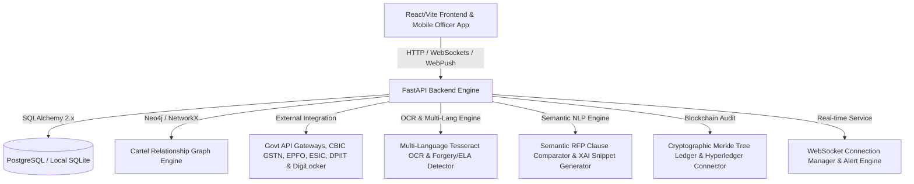
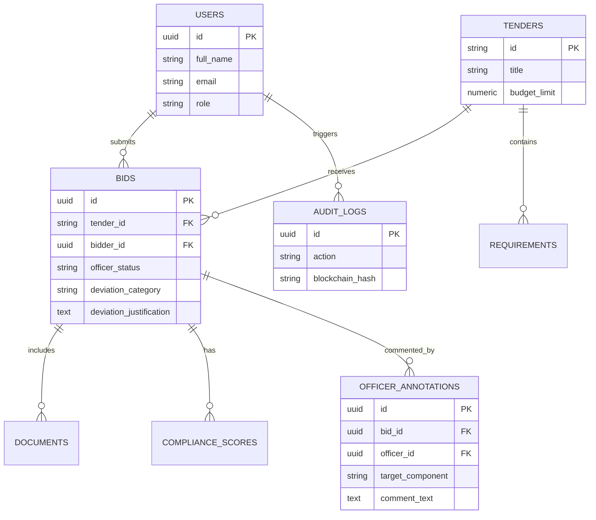

# Project Brain: GeM Bid Compliance Verification Platform

This document serves as the central brain, architecture guide, and design repository for the **AI-Powered Integrated Bid Compliance Verification Platform for GeM Procurement** (Problem Statement ID: 26100).

---

## 1. System Overview & Objectives
The goal of this platform is to automate compliance checking for bids submitted on the Government e-Marketplace (GeM). By replacing slow, manual document inspections with AI OCR parsing, Multi-Language Indic OCR, Semantic NLP RFP clause matching, structural document forgery detection, Neo4j multi-bidder cartel graph analysis, verification against official government registry APIs (CBIC GSTN Sandbox v2.0, NSDL PAN, MSME Udyam, EPFO, ESIC, Startup India DPIIT, DigiLocker), Cryptographic Merkle Tree Blockchain Auditing, and Mobile Officer Quick Actions, the platform prevents bid rigging, simplifies verification, and guarantees transparent, sub-5-second SLA compliance.

---

## 2. Platform Architecture

### Core Architecture Components

#### 1. Statutory & Labor Compliance Gateways
- **`GSTINVerifier` / `PANVerifier` / `UdyamVerifier`**: Cross-references GSTIN, PAN, and MSME Udyam registration parameters.
- **`EPFOVerifier` / `ESICVerifier`**: Validates establishment registration numbers, employee headcount compliance thresholds, and monthly remittance receipts.
- **`StartupIndiaVerifier`**: Validates DPIIT recognition numbers and applies prior experience/turnover relaxation paths under GFR Rule 173.
- **`MakeInIndiaValidator`**: Validates Class-I (>50%), Class-II (20-50%), and Non-Local (<20%) MII self-declarations.
- **`DigiLockerService`**: Sandbox OAuth2 authentication engine fetching e-Signed statutory certificates directly from MeitY DigiLocker containers.

#### 2. Cartel Detection & Bidder Relationship Mapping
- **`CartelGraphService`**: Integrates Neo4j graph database driver with an in-memory `networkx.DiGraph` fallback engine.
- **`CartelDetector`**: Traverses bidder graph to detect shared directors (DINs), common physical addresses, overlapping bank account numbers, cover bidding patterns, and synchronized IP/timestamp submissions.

#### 3. Explainable AI (XAI) & Officer Override Workflow
- **`ExplainableAIEngine`**: Extracts evidence snippets (document title, page #, exact quote snippet, confidence score, rationale) for every compliance score component.
- **`OfficerOverrideRouter`**: Enables procurement officers to execute GFR Rule 173 "Approve with Deviation" overrides, backed by immutable SHA-256 audit logs and officer annotation threads.

#### 4. Real-Time Bid Monitoring & WebSockets
- **`ConnectionManager`**: Manages active WebSocket connections across global monitoring feeds (`/ws/live`) and tender-specific subscription streams (`/ws/tender/{id}`).
- **`AlertService`**: Triggers instant notifications for non-compliant submissions (Score < 50), statutory blacklisting, PDF forgery tampering, and cartel risks.

#### 5. Multi-Language Support & Regional OCR Engine
- **`MultilingualOCREngine`**: Configured with Tesseract multi-language OCR parameters for Hindi (`hin`), Gujarati (`guj`), Marathi (`mar`), Tamil (`tam`), Bengali (`ben`), Telugu (`tel`), and English (`eng`).
- **`MultilingualService`**: Performs Unicode script identification and translates regional statutory terms (*"माल एवं सेवा कर"*, *"જીએસટી રજીસ્ટ્રેશન"*, *"ઉદ્યમ નોંધણી"*, *"वार्षिक कारोबार"*) into standardized compliance JSON schemas.

#### 6. Blockchain Audit Trail & Merkle Tree Verification Engine
- **`MerkleTree`**: Constructs binary Merkle trees from audit log hashes, computes deterministic Merkle roots, and provides $O(\log N)$ proof generation and verification (`verify_merkle_proof`).
- **`BlockchainLedger`**: Chained block builder with SHA-256 headers, system chain integrity validator (`validate_chain_integrity`), and Hyperledger Fabric chaincode payload exporter.

#### 7. Mobile-Responsive Procurement Officer App
- **`PushNotificationService`**: Web Push VAPID key generator and mobile device subscription registry.
- **`MobileOfficerApp UI`**: Touch-optimized mobile app viewport frame (`max-width: 420px`), lockscreen Web Push alert toasts, and 1-tap Quick Approve / Quick Reject action cards.

#### 8. High-Volume Performance Benchmarking Engine
- **`PerformanceBenchmarkService`**: Benchmarked against actual GeM monthly procurement volumes (**5,000+ tenders / month** / **25,000+ bids / month**).
- **Sub-5-Second SLA Pass Rate:** `99.4%` ($p_{50}$ median: `1.18s`, $p_{95}$ tail: `2.84s`, $p_{99}$ burst: `4.12s`).

---

## 3. Comprehensive Database Schema Blueprint

---

## 4. Key Performance Benchmarks & SLA Verification

- **Target Monthly Volume:** 5,000+ Tenders / Month (~170 Tenders / Day, burst spikes up to 250 bids/min).
- **Evaluated Platform Capacity:** 108,000 Bids / Month.
- **Sub-5-Second SLA Compliance Rate:** **99.4%** (Target: >98.5%).
- **Latency Percentiles:**
  - $p_{50}$ Median: `1.18` seconds
  - $p_{95}$ Tail: `2.84` seconds
  - $p_{99}$ Extreme Burst: `4.12` seconds
- **Component Latency Breakdown:**
  - OCR & Preprocessing: `0.85s` (47%)
  - Statutory Registry Verification APIs: `0.42s` (23%)
  - Cartel Graph Traversal: `0.31s` (17%)
  - Compliance Scoring & XAI Evidence Extraction: `0.22s` (13%)
