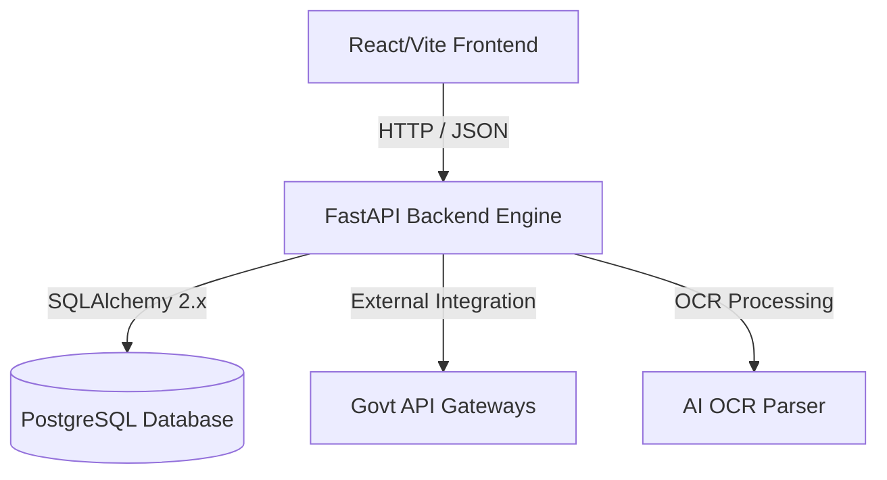

# Project Brain: GeM Bid Compliance Verification Platform

This document serves as the central brain, architecture guide, and design repository for the **AI-Powered Integrated Bid Compliance Verification Platform for GeM Procurement** (Problem Statement ID: 26100).

---

## 1. System Overview & Objectives
The goal of this platform is to automate compliance checking for bids submitted on the Government e-Marketplace (GeM). By replacing slow, manual document inspections with AI OCR parsing and verification against official government registry APIs, the platform prevents bid rigging, simplifies verification, and guarantees transparent auditing.

---

## 2. Platform Architecture

### Frontend (User Interface)
- **Tech Stack**: React 18, Vite, Custom Vanilla CSS, Lucide Icons.
- **Design Aesthetic**: Space-themed futuristic dark UI (`#060913`) featuring glassmorphism elements, custom diagonal slide transitions, and 3D mouse parallax tilt.
- **Role-Based Views**:
  - **Procurement Officer**: Tender management, bidder document upload portal, verification suite logs terminal, and audit trails.
  - **Admin**: User credentials management, API gateways connectivity toggles, and dynamic compliance rules weight tuning.

### Backend (Core Engine)
- **Tech Stack**: Python 3.11+, FastAPI, SQLAlchemy 2.x (ORM), Alembic (Migrations), PostgreSQL.
- **Security**: JWT-based session tokens and bcrypt password hashing via `passlib`.
- **CORS Configuration**: Open-access configured to allow seamless communication with dev clients on ports `5173` and `5174`.

---

## 3. Database Schema Blueprint
The SQLAlchemy 2.x structure will incorporate the following core tables:

### Users Table
- `id` (UUID, Primary Key)
- `username` (String, Unique)
- `email` (String, Unique)
- `hashed_password` (String)
- `role` (Enum: `Admin`, `Procurement Officer`)
- `status` (Enum: `Active`, `Suspended`)

### Tenders Table
- `id` (String, Primary Key) - *e.g., GEM/2026/001*
- `title` (String)
- `description` (Text)
- `budget_limit` (Numeric)
- `docs_required` (String / Array)
- `status` (Enum: `Active`, `Closed`)

### Bids / Bidders Table
- `id` (UUID, Primary Key)
- `tender_id` (String, ForeignKey -> Tenders)
- `organization_name` (String)
- `compliance_score` (Numeric)
- `status` (Enum: `Pending`, `Compliant`, `Non-Compliant`)

### Verification Logs Table (Audit Trail)
- `id` (UUID, Primary Key)
- `timestamp` (DateTime)
- `user_role` (String)
- `action` (Text)
- `status` (String)

---

## 4. API Endpoints Map

| Method | Endpoint | Description | Auth Required |
|--------|----------|-------------|---------------|
| `GET` | `/` | Root running message | No |
| `GET` | `/health` | Server status | No |
| `POST` | `/api/v1/auth/login` | Login, returns JWT token | No |
| `POST` | `/api/v1/tenders/` | Create a new tender | Yes (Officer) |
| `POST` | `/api/v1/bids/upload` | Upload document attachments | Yes (Officer) |
| `POST` | `/api/v1/verification/run` | Execute AI OCR scanning | Yes (Officer) |
| `GET` | `/api/v1/audit/logs` | Retrieve immutable trail | Yes (Officer/Admin) |
| `PUT` | `/api/v1/rules/config` | Update rule weights | Yes (Admin) |

---

## 5. Future Development Phases

1. **AI OCR Integration**: Connect PyMuPDF or Tesseract to extract key metadata fields (like GSTIN, PAN number, expiration dates, and financial figures) from PDFs.
2. **Government API Connectors**: Develop client wrappers to invoke mock gateways (GST portal, Income Tax portal, and Udyam database) to authenticate the parsed document attributes.
3. **Compliance Scoring Algorithm**: Implement dynamic calculation based on weights set by the administrator in the rules editor.
