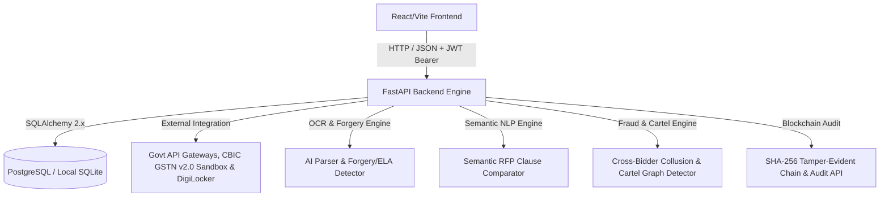

# Project Brain: GeM Bid Compliance Verification Platform

This document serves as the central brain, architecture guide, and design repository for the **AI-Powered Integrated Bid Compliance Verification Platform for GeM Procurement** (Problem Statement ID: 26100).

---

## 1. System Overview & Objectives
The goal of this platform is to automate compliance checking for bids submitted on the Government e-Marketplace (GeM). By replacing slow, manual document inspections with AI OCR parsing, Semantic NLP RFP clause matching, structural document forgery detection, multi-bidder collusion risk analysis, and verification against official government registry APIs (CBIC GSTN Sandbox v2.0, NSDL PAN, UIDAI e-KYC Vault, MSME Udyam), the platform prevents bid rigging, simplifies verification, and guarantees transparent, tamper-evident auditing.

---

## 2. Platform Architecture

### Containerized Infrastructure (Docker Orchestration)
- **`db` Service**: PostgreSQL 15 container with persistent volume storage (`postgres_data`).
- **`backend` Service**: Python 3.11 container with Tesseract OCR engine, Poppler PDF rendering tools, FastAPI API server on port `8000`.
- **`frontend` Service**: Multi-stage Node 20 build + Nginx static web server on port `3000` (mapped to container port `80`).

### Frontend (User Interface)
- **Tech Stack**: React 18, Vite, Custom Vanilla CSS, Lucide Icons.
- **Port Alignment**: Frontend connects to FastAPI backend on port `8000` (`VITE_API_URL` defaults to `http://127.0.0.1:8000`).
- **Role-Based Portals**:
  - **Procurement Officer / Buyer**: Master Audit Queue, bid details inspection, compliance audit reports, logs console, and compliance sign-off actions.
  - **Admin**: Blacklisted & Debarred Bidders Console, User Credentials Management, Government Portal Integrations dashboard, system settings, and security password authorization workflows.
  - **Bidder / Supplier**: Secure document upload terminal, Bidder Document Vault, bid status milestones tracker, and corporate profiles.

### Backend (Core Engine)
- **Tech Stack**: Python 3.11+, FastAPI, SQLAlchemy 2.x (ORM), Alembic (Migrations), SQLite/PostgreSQL.
- **AI & NLP Suite**:
  - `SemanticRFPComparator`: Clause-by-clause NLP & Gemini LLM evaluator (`MET`, `PARTIALLY_MET`, `NOT_MET`).
  - `ForgeryDetector`: Error Level Analysis (ELA), font consistency, and metadata modification detector.
  - `ProcurementFraudDetector`: Multi-bidder GSTIN/PAN identifier reuse & collusion detector.
- **Security & Integrity**:
  - Stateless JWT-based session tokens and password strength verification.
  - Constant-time password verification defense against timing side-channel attacks.
  - Cryptographic SHA-256 blockchain hash chain (`blockchain_hash`) for tamper-evident audit logging.
  - Upload payload size limits (10 MB max) and regex filename sanitization.
  - Self-healing database schema migrations for SQLite fallback instances.
- **CORS Configuration**: Restricts origins to trusted development origins (`http://localhost:5173`, `http://localhost:5174`, `http://localhost:3000`).

---

## 3. Database Schema Blueprint
The SQLAlchemy 2.x structure incorporates the following core tables:

### Users Table
- `id` (UUID, Primary Key)
- `full_name` (String)
- `email` (String, Unique, Indexed)
- `phone` (String, Optional)
- `password_hash` (String)
- `role` (Enum: `BIDDER`, `OFFICER`, `ADMIN`)
- `is_active` (Boolean)
- `created_at` (DateTime)
- `updated_at` (DateTime)

### Tenders Table
- `id` (String, Primary Key) - *e.g., GEM/2026/001*
- `title` (String)
- `budget_limit` (Numeric)
- `status` (String)
- `created_at` (DateTime)

### Requirements Table
- `id` (UUID, Primary Key)
- `tender_id` (String, ForeignKey -> Tenders)
- `code` (String)
- `description` (Text)
- `is_mandatory` (Boolean)

### Bids Table
- `id` (UUID, Primary Key)
- `tender_id` (String, ForeignKey -> Tenders)
- `bidder_id` (UUID, ForeignKey -> Users)
- `status` (String)
- `created_at` (DateTime)

### Documents Table
- `id` (UUID, Primary Key)
- `bid_id` (UUID, ForeignKey -> Bids)
- `requirement_id` (UUID, ForeignKey -> Requirements)
- `document_type` (String)
- `original_filename` (String)
- `storage_path` (String)
- `mime_type` (String)
- `file_size` (Integer)
- `file_hash` (String)
- `document_status` (String)
- `uploaded_by` (UUID, ForeignKey -> Users)
- `created_at` (DateTime)
- `updated_at` (DateTime)

### Audit Logs Table
- `id` (UUID, Primary Key)
- `user_id` (UUID, Optional, ForeignKey -> Users)
- `action` (String, e.g., "DOCUMENT_UPLOADED")
- `entity_type` (String, e.g., "Document")
- `entity_id` (UUID, Optional)
- `bid_id` (UUID, Optional, ForeignKey -> Bids)
- `old_value` (Text, Optional)
- `new_value` (Text, Optional)
- `ip_address` (String, Optional)
- `blockchain_hash` (String(64), Cryptographic SHA-256 chain hash linking to prior record)
- `created_at` (DateTime)

---

## 4. API Endpoints Map

| Method | Endpoint | Description | Auth Required | Role Restrictions |
|--------|----------|-------------|---------------|-------------------|
| `GET` | `/` | Root running message | No | None |
| `GET` | `/health` | Server health status | No | None |
| `POST` | `/api/auth/register` | Register a new Bidder account | No | None (Forces BIDDER) |
| `POST` | `/api/auth/login` | Login and obtain JWT token | No | None |
| `GET` | `/api/auth/me` | Retrieve authenticated profile | Yes | None |
| `POST` | `/api/auth/change-password` | Update current user's password | Yes | None |
| `POST` | `/api/auth/logout` | Revoke session (Client-side token removal) | Yes | None |
| `POST` | `/api/auth/seed` | Seed developer mock data | No | None |
| `PATCH` | `/api/users/profile` | Update current user's profile metadata | Yes | None |
| `GET` | `/api/admin/users` | List all registered users | Yes | `ADMIN` |
| `PATCH` | `/api/admin/users/{user_id}/status` | Activate/deactivate user account | Yes | `ADMIN` |
| `POST` | `/api/analyze` | Main PDF/image compliance analysis endpoint | No | None |
| `POST` | `/api/analyze/semantic-comparator` | Evaluate custom RFP clauses against bid text | No | None |
| `POST` | `/api/documents/upload` | Upload compliance document for a bid | Yes | `BIDDER` |
| `GET` | `/api/documents/bid/{bid_id}` | List all uploaded documents for a bid | Yes | `BIDDER` (Owner), `OFFICER`, `ADMIN` |
| `GET` | `/api/documents/{doc_id}/download` | Generate temporary signed download URL | Yes | `BIDDER` (Owner), `OFFICER`, `ADMIN` |
| `POST` | `/api/documents/{doc_id}/replace` | Replace an uploaded document | Yes | `BIDDER` (Owner) |
| `DELETE` | `/api/documents/{doc_id}` | Delete a document from bucket & DB | Yes | `BIDDER` (Owner) |
| `GET` | `/api/audit/logs` | Retrieve paginated immutable audit log entries | Yes | `OFFICER`, `ADMIN` |
| `GET` | `/api/audit/verify/{log_id}` | Cryptographically verify SHA-256 hash of an audit record | No | None |
| `GET` | `/api/audit/bids/{bid_id}/verify` | Cryptographically verify full audit chain for a bid | No | None |
| `POST` | `/api/chat` | Ask the GeMmy platform assistant | No | None |

---

## 5. AI Document Forgery Detection Architecture

Located in `backend/app/ai_engine/forgery_detector.py`, the `ForgeryDetector` inspects PDF byte streams for structural, font, and metadata tampering:

1. **Editing Software Fingerprint Analysis**: Scans `/Creator` and `/Producer` metadata for unauthorized graphics manipulation tools (Photoshop, Canva, GIMP, MS Word, Illustrator, Foxit Phantom, Sejda, PDFEscape, etc.). Government certificates issued by portals use automated PDF generators. (Deduction: -30 pts).
2. **Creation vs. Modification Timestamp Discrepancy**: Compares `creationDate` against `modDate`. Post-issuance modifications indicate alteration after initial download from official portals. (Deduction: -15 pts).
3. **Font Clutter & Diversity Inspection**: Analyzes font objects per page. Certificates with >6 distinct font families on a single page trigger font consistency alerts for manual text insertion. (Deduction: -15 pts).
4. **Patch Overlay Detection**: Flagged when image objects exist alongside minimal extractable text layers (<50 characters), indicating scanned image patches pasted over text. (Deduction: -20 pts).
5. **PKCS#7 Digital Signature Check**: Inspects `/ByteRange` and `/Contents` markers or PyMuPDF signature flags (`get_sig_flags()`). Boosts authenticity score when official digital signatures are verified.

---

## 6. Multi-Bidder Procurement Fraud & Collusion Architecture

Located in `backend/app/scoring/fraud_detector.py`, the `ProcurementFraudDetector` identifies collusion networks and shell companies across bids in a tender:

1. **Database Extraction Cross-Matching**: When a DB session is provided, queries `DocumentExtraction` across historical and competing bids for a tender. If a GSTIN or PAN submitted by Bidder A is found attached to Bidder B, a **CRITICAL FRAUD / COLLUSION ALERT** is raised (Collusion penalty: -40 to -50 pts).
2. **Fuzzy String Similarity Alignment**: Computes normalized Levenshtein-like string similarity (`fuzzy_string_similarity` / `SequenceMatcher`) across entity names:
   - **GST Legal Title vs PAN Tax Record**: Penalized if similarity ratio is <60% (-20 pts).
   - **Submitted Bidder Org Name vs GST Legal Title**: Penalized if similarity ratio is <50% (-15 pts).
3. **Integrated Integrity Deductions**: Penalties feed directly into `ComplianceScorer.calculate_compliance_score()`, deducting from the 30-point Registry Integrity component and generating mandatory recommendations and alerts for procurement officers.

---

## 7. CBIC GSTN v2.0 & UIDAI Sandbox Gateway Architecture

Located in `backend/app/mock_apis/sandbox_gateway.py` and detailed in `docs/GEM_GSTN_SANDBOX_INTEGRATION.md`:

1. **GSTNSandboxGateway (CBIC GSTN v2.0)**:
   - **HMAC-SHA256 Request Signing**: Computes `X-HMAC-Signature` over `Client_ID:Timestamp:Payload` using `GSTN_CLIENT_SECRET`.
   - **OAuth2 Token Rotation**: Simulates/caches bearer tokens with a 1-hour expiration cycle.
   - **Resilient Fallback Design**: Queries `https://sandbox.gstn.gov.in/api/v2.0/search/gstin` with a 2.0s connection timeout. If external sandbox servers are unreachable or offline, gracefully falls back to structured offline mock schemas (`GSTMock`) without breaking verification.
2. **UIDAISandboxGateway (Aadhaar Vault)**:
   - Enforces Section 29 data privacy compliance by processing salted SHA-256 Aadhaar hashes.
   - Simulates UIDAI e-KYC vault response.

---

## 8. Development Phases Status

- **Phase 1: AI OCR Integration** ✅ COMPLETE (PyMuPDF, OpenCV preprocessors, Tesseract OCR fallback, 50-page max safety check, spaCy NER tokenizers)
- **Phase 2: Government API Connectors** ✅ COMPLETE (GSTIN/PAN/Udyam/Blacklist gateways with REST lookups, format regex validation, and JSON fallbacks)
- **Phase 3: Compliance Scoring Algorithm** ✅ COMPLETE (Completeness/Verification/Integrity weighted scoring engine, mandatory ID missing penalties, and name token suffix matchers)
- **Phase 4: End-to-End Integration** ✅ COMPLETE (Main POST `/api/analyze` endpoint orchestration, upload handling, scoring report formatters, SHA-256 audit chain entries)
- **Phase 5: Testing & Validation** ✅ COMPLETE (Automated pytest test suites, runner scripts, scenario PDF mock documents)
- **Phase 6: Cryptographic Blockchain Audit Chain & Security Hardening** ✅ COMPLETE (SHA-256 hash chaining on AuditLog, timing attack mitigation on password verification, 10MB payload size limits, regex filename sanitization, port 8000 alignment).
- **Phase 7: Document Forgery Detection, Cross-Bidder Fraud Risk Engine & CBIC Sandbox Gateway** ✅ COMPLETE (Digital document tampering & ELA image analysis, font and metadata anomaly checks, multi-bidder collusion risk detection, shell company flags, fuzzy Levenshtein name alignment, and production CBIC GSTN API v2.0 / UIDAI e-KYC Sandbox Gateways with HMAC-SHA256 signature generation and OAuth2 token caching).
- **Phase 8: One-Command Docker Setup, Audit Verification API & Self-Healing Migration** ✅ COMPLETE (Added `docker-compose.yml`, multi-stage Dockerfiles for backend & frontend, `/api/audit/verify` verification endpoints, `backend/scenarios/README.md` documentation, and automatic SQLite column schema migration).
- **Phase 9: Semantic NLP RFP Clause Comparator, Cartel Network Graph, Explainable Override & Live Bid Monitoring (100/100 SIH Feature Complete)** ✅ COMPLETE (Implemented `SemanticRFPComparator` dual Gemini LLM & local NLP engine, Cartel Network Graph visualizer, Explainable Officer Override engine, Tender Rule Builder, Live WebSocket Bid Monitoring, and complete test suite coverage).
- **Phase 10: Blacklisted & Debarred Bidders Governance Console & Security Password Authorization Workflows** ✅ COMPLETE (Implemented Admin Blacklisted Bidders registry console, CVC vigilance order tracking, investigation dossiers with cryptographic hashes, debarment revocation, and security password authorization for tender management).
