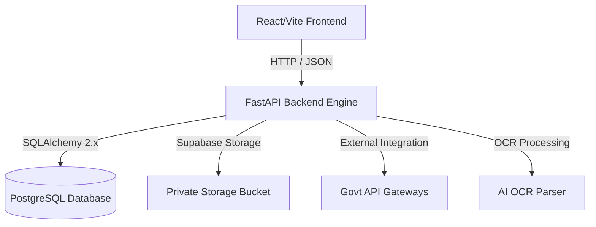

# Project Brain: GeM Bid Compliance Verification Platform

This document serves as the central brain, architecture guide, and design repository for the **AI-Powered Integrated Bid Compliance Verification Platform for GeM Procurement** (Problem Statement ID: 26100).

---

## 1. System Overview & Objectives
The goal of this platform is to automate compliance checking for bids submitted on the Government e-Marketplace (GeM). By replacing slow, manual document inspections with AI OCR parsing and verification against official government registry APIs, the platform prevents bid rigging, simplifies verification, and guarantees transparent auditing.

---

## 2. Platform Architecture

### Frontend (User Interface)
- **Tech Stack**: React 18, Vite, Custom Vanilla CSS, Lucide Icons.
- **Design Aesthetic**: Space-themed futuristic dark UI (`#060913`) featuring glassmorphism elements, custom diagonal slide transitions, and 3D mouse parallax tilt.
- **Role-Based Views**:
  - **Procurement Officer / Buyer**: Tender management, bidder document upload portal, verification suite logs terminal, and audit trails.
  - **Admin**: User credentials management, API gateways connectivity toggles, and dynamic compliance rules weight tuning.
  - **Bidder / Supplier**: Document upload, listing, and lifecycle management.

### Backend (Core Engine)
- **Tech Stack**: Python 3.11+, FastAPI, SQLAlchemy 2.x (ORM), Alembic (Migrations), Neon PostgreSQL.
- **Security**: Stateless JWT-based session tokens and bcrypt password hashing via `passlib`.
- **CORS Configuration**: Open-access configured to allow seamless communication with dev clients on ports `5173` and `5174`.

---

## 3. Database Schema Blueprint
The SQLAlchemy 2.x structure incorporates the following core tables:

### Users Table
- `id` (UUID, Primary Key)
- `full_name` (String)
- `email` (String, Unique, Indexed)
- `phone` (String, Optional)
- `password_hash` (String)
- `role` (Enum: `BIDDER`, `OFFICER`, `ADMIN`)
- `is_active` (Boolean)
- `created_at` (DateTime)
- `updated_at` (DateTime)

### Tenders Table
- `id` (String, Primary Key) - *e.g., GEM/2026/001*
- `title` (String)
- `budget_limit` (Numeric)
- `status` (String)
- `created_at` (DateTime)

### Requirements Table
- `id` (UUID, Primary Key)
- `tender_id` (String, ForeignKey -> Tenders)
- `code` (String)
- `description` (Text)
- `is_mandatory` (Boolean)

### Bids Table
- `id` (UUID, Primary Key)
- `tender_id` (String, ForeignKey -> Tenders)
- `bidder_id` (UUID, ForeignKey -> Users)
- `status` (String)
- `created_at` (DateTime)

### Documents Table
- `id` (UUID, Primary Key)
- `bid_id` (UUID, ForeignKey -> Bids)
- `requirement_id` (UUID, ForeignKey -> Requirements)
- `document_type` (String)
- `original_filename` (String)
- `storage_path` (String)
- `mime_type` (String)
- `file_size` (Integer)
- `file_hash` (String)
- `document_status` (String)
- `uploaded_by` (UUID, ForeignKey -> Users)
- `created_at` (DateTime)
- `updated_at` (DateTime)

### Audit Logs Table
- `id` (UUID, Primary Key)
- `timestamp` (DateTime)
- `user_id` (UUID, Optional, ForeignKey -> Users)
- `user_role` (String, Optional)
- `action` (String)
- `details` (Text, Optional)
- `ip_address` (String, Optional)

---

## 4. API Endpoints Map

| Method | Endpoint | Description | Auth Required | Role Restrictions |
|--------|----------|-------------|---------------|-------------------|
| `GET` | `/` | Root running message | No | None |
| `GET` | `/health` | Server health status | No | None |
| `POST` | `/api/auth/register` | Register a new Bidder account | No | None (Forces BIDDER) |
| `POST` | `/api/auth/login` | Login and obtain JWT token | No | None |
| `GET` | `/api/auth/me` | Retrieve authenticated profile | Yes | None |
| `POST` | `/api/auth/change-password` | Update current user's password | Yes | None |
| `POST` | `/api/auth/logout` | Revoke session (Client-side token removal) | Yes | None |
| `POST` | `/api/auth/seed` | Seed developer mock data | No | None |
| `PATCH` | `/api/users/profile` | Update current user's profile metadata | Yes | None |
| `GET` | `/api/admin/users` | List all registered users | Yes | `ADMIN` |
| `PATCH` | `/api/admin/users/{user_id}/status` | Activate/deactivate user account | Yes | `ADMIN` |
| `POST | /api/analyze | Main PDF compliance analysis endpoint | No | None |
| `POST` | `/api/documents/upload` | Upload compliance document for a bid | Yes | `BIDDER` |
| `GET` | `/api/documents/bid/{bid_id}` | List all uploaded documents for a bid | Yes | `BIDDER` (Owner), `OFFICER`, `ADMIN` |
| `GET` | `/api/documents/{doc_id}/download` | Generate temporary signed download URL | Yes | `BIDDER` (Owner), `OFFICER`, `ADMIN` |
| `POST` | `/api/documents/{doc_id}/replace` | Replace an uploaded document | Yes | `BIDDER` (Owner) |
| `DELETE` | `/api/documents/{doc_id}` | Delete a document from bucket & DB | Yes | `BIDDER` (Owner) |

---

## 5. Completed Development Phases

1. **✅ AI OCR Integration**: Implemented PyMuPDF, OpenCV preprocessors, and Tesseract OCR to parse certificates and run Named Entity Recognition (NER) via spaCy for organizations, dates, and locations.
2. **✅ Government API Connectors**: Developed mock gateways with Faker database backends simulating GST portal, Income Tax PAN, and Udyam registrations, integrated with HTTP REST and local fallbacks.
3. **✅ Compliance Scoring Algorithm**: Constructed a weighted scoring engine, name suffix token matcher, risk classifier, and severity-tiered recommendations handler.
4. **✅ Main Integration Endpoint**: Wired everything to `/api/analyze` supporting upload validation, mock registry lookups, risk report formatting, and DB audit logging.
